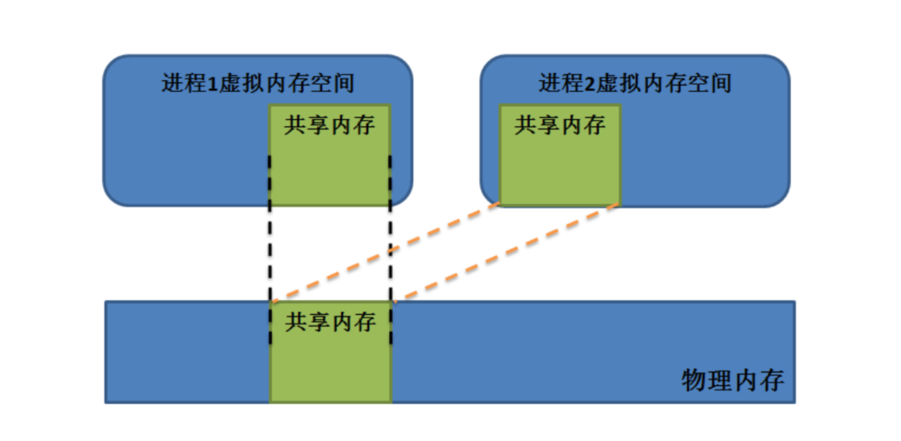

## Linux应用开发-共享内存

#### 共享内存的概念

##### 共享内存是将多个进程的虚拟地址映射到一块物理地址上面，让互不通信的进程之间进行通信。



1、共享内存由以下特点：

```
- 共享内存是进程间通信中效率最高的方式之一。
- 共享内存是系统出于多个进程之间通讯的考虑，而预留的的一块内存区，因此共享内存是以传输数据为目的的。
- 共享内存允许两个或更多进程访问同一块内存，当一个进程改变了这块地址中的内容的时候，其它进程都会察觉到这个更改。
- 共享内存无同步无互斥。
```

2、共享内存的优缺点：

```
- 优点：使用共享内存进行进程间的通信非常方便，而且函数的接口也简单，数据的共享使
进程间的数据不用传送，而是直接访问内存，加快了程序的效率。任意进程之间都可以对共享内存做读写操作。
- 缺点：共享内存没有提供同步的机制，这使得我们在使用共享内存进行进程间通信时，往
往要借助其他的手段（如信号量、互斥量等）来进行进程间的同步工作。
```

#### 共享内存API函数

##### 创建共享内存函数

shmget() 函数的创建或获取一个共享内存对象，并返回共享内存标识符。  

```
int shmget(key_t key, size_t size, int shmflg);
- key：标识共享内存的键值
- size：共享内存大小，所有的内存分配操作都是以页为单位的，所以即使只申请只有一个字节的内存，内存也会分配整整一页。
- shmflg：创建的共享内存的模式标志参数
	* IPC_CREAT：如果内核中不存在关键字与 key 相等的共享内存，则新建一个共享内存；如果存在这样的共享内存，返回此共享内存的标识符。
	* IPC_EXCL：如果内核中不存在键值与 key 相等的共享内存，则新建一个共享内存；如果存在这样的共享内存则报错。
	* SHM_HUGETLB：使用“大页面”来分配共享内存，所谓的“大页面”指的是内核为了提高程序性能，对内存实行分页管理时，采用比默认尺寸（4KB）更大的分页，以减少缺页中断。
	* SHM_NORESERVE：不在交换分区中为这块共享内存保留空间。
返回值： shmget() 函数的返回值是共享内存的 ID。创建失败返回-1。
错误代码：
- EACCES：指定的消息队列已存在，但调用进程没有权限访问它
- EEXIST： key 指定的消息队列已存在，而 msgflg 中同时指定 IPC_CREAT 和 IPC_EXCL 标志
- EINVAL：创建共享内存时参数 size 小于 SHMMIN 或大于 SHMMAX。
- ENFILE：已达到系统范围内打开文件总数的限制。
- ENOENT：给定的 key 不存在任何共享内存，并且未指定 IPC_CREAT。
- ENOMEM：内存不足，无法为共享内存分配内存。
- EACCES：没有权限。
```

##### 内存映射函数

shmat() 映射函数  ，共享内存区对象映射到调用进程的地址空间  。

```
void *shmat(int shmid, const void *shmaddr, int shmflg);
- shmid：共享内存 ID，通常是由 shmget() 函数返回的。
- shmaddr：如果不为 NULL，则系统会根据 shmaddr 来选择一个合适的内存区域，如果为NULL，则系统会自动选择一个合适的虚拟内存空间地址去映射共享内存。
- shmflg：操作共享内存的方式：
    * SHM_RDONLY：以只读方式映射共享内存。
    * SHM_REMAP：重新映射，此时 shmaddr 不能为 NULL。
    * NULLSHM：自动选择比 shmaddr 小的最大页对齐地址。
shmat() 函数调用成功后返回共享内存的起始地址。

注意：
- 共享内存只能以只读或者可读写方式映射，无法以只写方式映射。
- shmat() 第二个参数 shmaddr 一般都设为 NULL，让系统自动找寻合适的地址。但当其确实
不为空时，那么要求 SHM_RND 在 shmflg 必须被设置，这样的话系统将会选择比 shmaddr
小而又最大的页对齐地址（即为 SHMLBA 的整数倍）作为共享内存区域的起始地址。如果
没有设置 SHM_RND，那么 shmaddr 必须是严格的页对齐地址。
```

##### 解除内存映射函数

shmdt() 函数是用来解除进程与共享内存之间的映射的，在解除映射后，该进程不能再访问这个共享内存  。

```
int shmdt(const void *shmaddr);
- shmaddr：映射的共享内存的起始地址。

注意：该函数并不删除所指定的共享内存区，而只是将先前用 shmat() 函数映射好的共享内存脱离当前进程，共享内存还是存在于物理内存中。
```

##### 获取或设置属性函数  

shmctl() 用于获取或者设置共享内存的相关属性。  

```
int shmctl(int shmid, int cmd, struct shmid_ds *buf);
- shmid：共享内存标识符。
- cmd：函数功能的控制命令，其取值如下：
    * IPC_STAT：获取属性信息，放置到 buf 中。
    * IPC_SET：设置属性信息为 buf 指向的内容。
    * IPC_RMID：删除这该共享内存。
    * IPC_INFO：获得关于共享内存的系统限制值信息。
    * SHM_INFO：获得系统为共享内存消耗的资源信息。
    * SHM_STAT：与 IPC_STAT 具有相同的功能，但 shmid 为该 SHM 在内核中记录所有SHM 信息的数组的下标，因此通过迭代所有的下标可以获得系统中所有 SHM 的相关信息。
    * SHM_LOCK：禁止系统将该 SHM 交换至 swap 分区。
    * SHM_UNLOCK：允许系统将该 SHM 交换至 swap 分。
- 共享内存属性信息结构体指针（属性缓冲区）一般设为NULL
```

