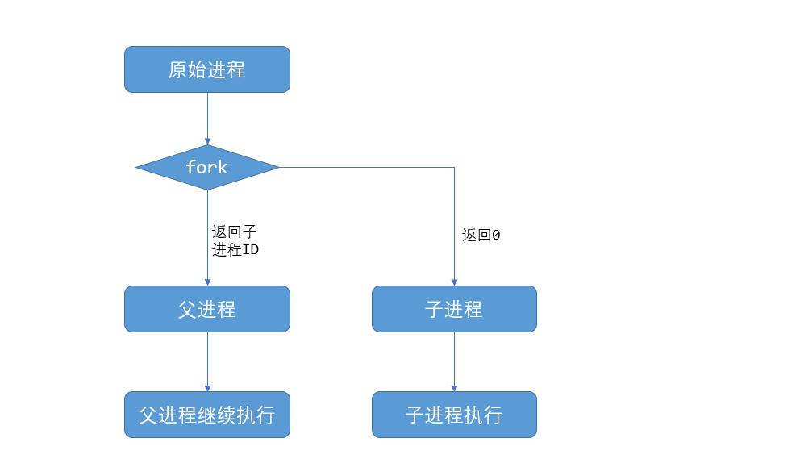
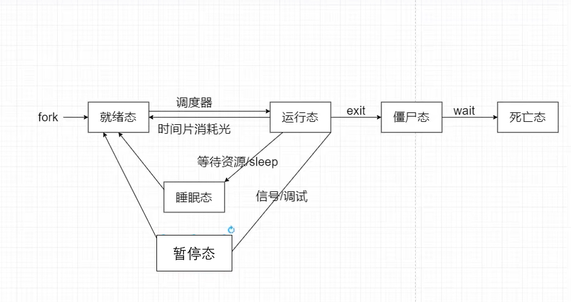

## Linux应用编程-进程

##### fork()进程函数：

fork()进程函数用于从一个已存在的进程中去启动一个新进程，新进程成为子进程，原来的进程称为父进程。fork()函数的本质是直接将父进程的内容复制一份，但是子进程与父进程也有不一样的地方。

子进程与父进程相同的内容：

- 进程的地址空间
- 进程上下文，代码段
- 进程的堆栈空间，和内存信息
- 进程的环境变量，标准的IO缓冲区
- 打开的文件描述符，信号响应函数，当前的工作路劲

子进程独有的内容：

- 子进程的进程号PID，PID是进程的唯一的标识符
- 记录锁，父进程对某文件加锁，子进程不会继承这把锁
- 挂起信号，父进程的响应但未处理的信号，子进程不会继承



fork函数

```
pid_t fork(void);

fork函数启动成功：父进程会返回子进程的pid,子进程返回0，
启动失败：返回-1

pid_t getpid(void);函数会返回当前进程pid
pid_t getppid(void);函数会返回当前进程的父进程pid

```

##### exec系列进程替换函数

exec系列函数用于替换进程的执行程序，它可以根据指定的文件名或目录名找到可执行文件，并用它来取代原调用进程的数据段、代码段和堆栈段，在执行完之后，原调用进程的内容除了进程号外，其他全部被新程序的内容替换  

exec系列函数介绍：

```
int execl(const char *path, const char *arg, ...)
int execlp(const char *file, const char *arg, ...)
int execle(const char *path, const char *arg, ..., char *const envp[])
int execv(const char *path, char *const argv[])
int execvp(const char *file, char *const argv[])
int execve(const char *path, char *const argv[], char *const envp[])

这些函数可以分为两大类execl、execlp和execle传递给子程序的参数个数是可变的。 execv、 execvp 和 execve 通过数组去装载子程序的参数，无论那种形式，参数都以一个空指针 NULL 结束.
l----list 列表
v----vector 数组

参数介绍：
const char *path:该参数需要输入文件路径，例如："/bin/ls" "/bin/pwd"
const char *file:该参数需要输入需要执行的应用程序名字，例如："ls" "pwd"
const char *arg:该参数需要输入对应字符，例如："ls","-al",NULL "pwd",NULL
const char *agrv[]:该参数需要输入对应数组指针：例如：char *argv[]={"pwd",NULL};


！！注意：exec 系列函数是直接将当前进程给替换掉的，当调用 exec 系列函数后，当前进程将不会
再继续执行，
```

execl函数：

```
int execl(const char *path, const char *arg, ... )
path:指定文件路径
arg：执行文件所传递的参数 arg[0],arg[1]...arg[n],最后一个参数必须是NULL做结束标志

该函数一般不会返回，除非遇到错误会返回-1

```

execv函数：

```
int execv(const char *path, char *const argv[])
path:指定文件路径
argv：执行文件所传递的参数是一个数组指针,最后一个参数必须是NULL做结束标志

该函数一般不会返回，除非遇到错误会返回-1
```

##### 进程的生老病死



##### 进程终止

- 正常终止

  ```
  -main 函数返回
  -调用_exit()函数终止
  -调用exit()函数终止
  ```

- 异常终止

  ```
  -调用abort()函数异常终止
  -又系统信号终止 
  ```

exit函数和_exit()函数：

```
void _exit(int status);
void exit(int status);
传入一个status保存进程终止时的状态码
```

exit()函数和_exit()函数的异同：

```
exit() 和 _exit() 函数都是用来终止进程的，当程序执行到 exit() 或 _exit() 函数时，进程会无条件地停止剩下的所有操作，清除包括 PCB 在内的各种数据结构，并终止当前进程的运行。

_exit() 函数:直接通过系统调用使进程终止运行,清除这个进程使用的内存空间，并销毁它在内核中的各种数据结构.
exit() 函数是_exit()函数包装来的。在执行_exit()函数之前，需要清除"IO缓冲区"，有效的保存数据的完整性。
清清除"IO缓冲区"是检查文件的打开情况，把文件缓冲区中的内容写回文件
```

##### 等待进程

当一个进程调用了exit()函数之后，该进程并不会直接消失，而是会变成僵尸进程。需要等待其父进程去回收僵尸进程，需要调用waitpid()或者wait()函数去回收僵尸进程并且，释放僵尸进程占有的内存空间，和了解进程终止的状态信息。调用wait函数会阻塞父进程。

wait函数和waitpid函数：

```
//wait函数
pid_t wait(int *wstatus);
调用wait函数之后 调用成功：返回子进程pid，和进程退出状态
失败:返回-1

pid_t waitpid(pid_t pid, int *wstatus, int options);
pid:欲等待的子进程的识别码。
	• pid<-1	等待进程组号为pid绝对值的任何子进程。
	• pid>0	等待进程号为pid的子进程。
	• pid=-1	等待任何子进程，此时的waitpid()函数就退化成了普通的wait()函数。
	• pid=0	等待进程组号与目前进程相同的任何子进程，也就是说任何和调用waitpid()函数的进程在同一个进程组的进程。
wstatus：返回的状态值
options：控制waitpid()函数的行为，如果不想使用这些选项，则可以把这个参数设为0。
	• WNOHANG	如果pid指定的子进程没有结束，则waitpid()函数立即返回0，而不是阻塞在这个函数上等待；如果结束了，则返回该子进程的进程号。
	• WUNTRACED	如果子进程进入暂停状态，则马上返回。
	
调用wait函数之后 调用成功：返回子进程pid，和进程退出状态
失败:返回-1


//waitpid函数
如果在调用waitpid()函数时，当指定等待的子进程已经停止运行或结束了，则waitpid()会立即返回；
但是如果子进程还没有停止运行或结束，则调用waitpid()函数的父进程则会被阻塞，暂停运行。

waitpid(-1,&status,0) = wait(&status)

//wait和waitpid函数调用之后返回 wstatus 的值
• WIFEXITED(status) ：如果子进程正常结束，返回一个非零值
• WEXITSTATUS(status)：如果 WIFEXITED 非零，返回子进程退出码
• WIFSIGNALED(status) ：子进程因为捕获信号而终止，返回非零值
• WTERMSIG(status) ：如果 WIFSIGNALED 非零，返回信号代码
• WIFSTOPPED(status)：如果子进程被暂停，返回一个非零值
• WSTOPSIG(status)：如果 WIFSTOPPED 非零，返回一个信号代码
```

##### 进程组，会话，终端

- 进程组

```
进程组：
• 对相同的类型的进程进行管理
进程组的诞生：
• 在shell里面直接执行一个应用程序，对于大部分应用程序，自己就是进程组的首进程。进程组只有一个进程
• 如果进程调用了fork函数，那么父子进程同属一个进程组，父进程为首进程
• shell中通过管道执行连接起来的应用程序，两个程序同属一个进程组，第一个程序为进程组的首进程

进程组id:pgid,由首进程pid决定 
pgid：进程组所在的id号
```

- 会话（一般关联着一个终端）

```
会话：管理前后台进程组
会话的诞生：
• 调用调用setsid函数，新建一个会话，应用程序作为会话的第一个进程，称为会话首进程
• 用户在终端正确登录之后，启动shell时linux系统会创建一个新的会话，shell进程作为会话首进程。
会话id:sid
sid:会话首进程id
```

- 前台进程组

```
前台进程组：
shell进程启动时，默认是前台进程组的首进程
前台进程组的首进程会占用绘画所关联的终端来运行，shell启动其他应用程序时，其他程序成为首进程
```

- 后台进程组

```
后台进程组的程序是不会占用终端的。
在shell终端运行程序时，在后面加上&的符号，可以指定程序运行在后台进程组里面。
例：sleep 10 &

ctrl+z：会使进程进入后台，同时停止执行。返回终端
jobs:查看有哪些后台进程组，和jobs id
fg +job id可以把后台进程组切换为前台进程组
```

- 终端

```
物理终端
• 串口终端
• lcd终端
伪终端（不依赖物理设备）
• SSH远程连接产生的终端
• 桌面系统产生的终端
虚拟终端
• linux内核自带的 ctrl+alt+f0~f6来打开不同的终端

终端被关闭之后，会话中的所有进程都会被关掉
```

##### 守护进程

守护进程不受终端影响的，终端退出，而也可以继续在后台运行，

写守护进程步骤：

```
• 创建一个子进程，父进程直接退出，
	- 使用fork()函数创建,
• 创建一个新的会话
	- 父进程使用setsid()函数创建一个新的会话，没有关联任何终端
• 改变守护进程的当前工作目录，改为"/"。因为子进程会继承父进程的工作目录的。所以需要改变工作目录。
	- 父进程使用chdir()函数实现
• 重设文件权限的掩码（umask可以查看文件权限掩码 0022 -- 只写）
	新建文件的权限默认使0666,需要与掩码进行与非(&~)的运算才是实际的文件权限
	-父进程使用umask()函数实现 umask直接设置为0
• 关闭不需要的文件描述符
	- 父进程使用close()函数实现
    - 0，1，2文件描述符，分别对应终端的标准输入，输出，出错。不需要与终端相关联所以需要关闭这些文件描述符。
```

