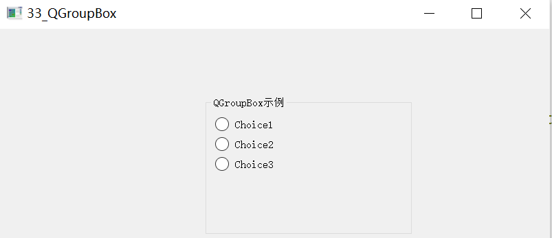
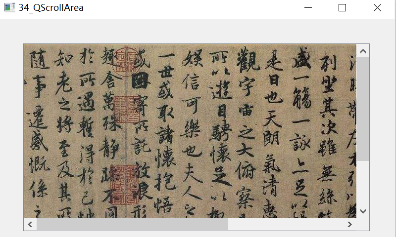
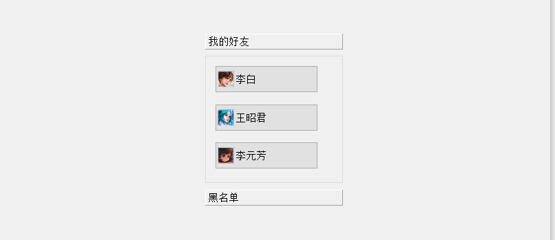
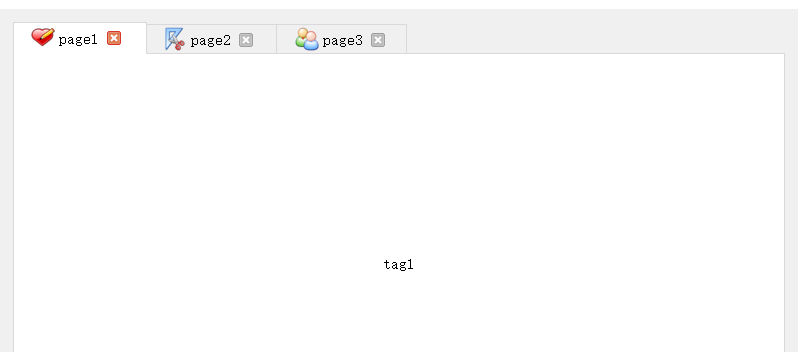
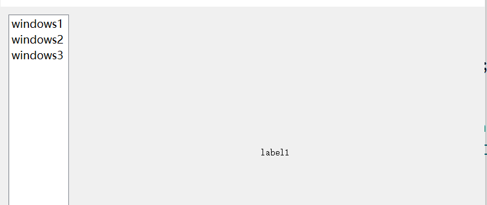
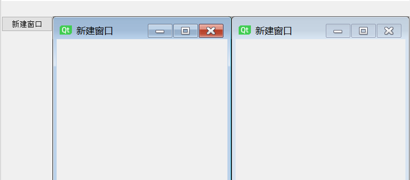
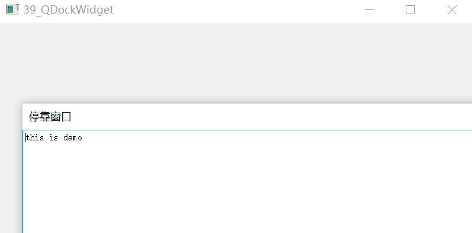

## Qt容器

### QGroupBox

QGroupBox 小部件提供一个带有标题的组框框架。 一般与一组或者是同类型的部件一起使用。  

##### 代码示例

```
#include "mainwindow.h"
#include <QList>

MainWindow::MainWindow(QWidget *parent)
    : QMainWindow(parent)
{
    this->setGeometry(0,0,800,480);
    groupBox = new QGroupBox(tr("QGroupBox示例"),this);
//    groupBox->setTitle("QGroupBox示例");
    groupBox->setGeometry(300,100,300,200);
    vBoxLayout = new QVBoxLayout();

    QList <QString> list;
    list<<"Choice1"<<"Choice2"<<"Choice3";

    for(int i = 0;i < 3;i ++){
        radioButton[i] = new QRadioButton(this);
        radioButton[i]->setText(list[i]);
        vBoxLayout->addWidget(radioButton[i]);
    }
    /*添加一个伸缩量*/
    vBoxLayout->addStretch(1);
    groupBox->setLayout(vBoxLayout);
}
```

##### ui示例



### QScrollArea

QScrollArea 类提供到另一个小部件的滚动视图  

##### 代码示例

```
#include "mainwindow.h"

MainWindow::MainWindow(QWidget *parent)
    : QMainWindow(parent)
{
    this->setGeometry(0,0,800,480);

    scrollArea = new QScrollArea(this);

    /*设置滚动区域*/
    scrollArea->setGeometry(50,50,700,380);
    label = new QLabel();
    /*标签显示图片，分辨率为1076 * 500*/
    QImage image(":/images/lantingxu.png");
    label->setPixmap(QPixmap::fromImage((image)));
    scrollArea->setWidget(label);
}
```

##### ui示例



### QToolBox

QToolBox（工具盒类）提供了一种列状的层叠窗体，中文译为工具箱，类似抽屉。  

##### 代码示例

```
#include "mainwindow.h"
#include <QList>

MainWindow::MainWindow(QWidget *parent)
    : QMainWindow(parent)
{
    this->setGeometry(0,0,800,480);
    toolBox = new QToolBox(this);
    toolBox->setGeometry(300,50,200,250);
    /*设置toolBox的样式*/
    toolBox->setStyleSheet("QToolBox {backgroud-color:rgba{0,0,0,30%)}");
    for(int i = 0;i < 2;i ++){
        vBoxLayout[i] = new QVBoxLayout(this);
        groupBox[i] = new QGroupBox(this);
    }
    QList <QString> strList;
    strList<<"李白"<<"王昭君"<<"李元芳"<<"程咬金"<<"钟馗"<<"上官婉儿";
    QList <QString> iconList;
    iconList<<":/icons/libai"<<":/icons/wangzhaojun"<<":/icons/liyuanfang"
           <<":/icons/chengyaojin"<<":/icons/zhongkui"<<":/icons/shangguanwaner";
    for(int i = 0;i < 6;i ++){
        toolButton[i] = new QToolButton(this);
        /*设置toolButton图标*/
        toolButton[i]->setIcon(QIcon(iconList[i]));
        /*设置toolButton文本*/
        toolButton[i]->setText(strList[i]);
        /*设置toolButton 的大小*/
        toolButton[i]->setFixedSize(150,40);
        /*设置toolButton的样式*/
        toolButton[i]->setToolButtonStyle(Qt::ToolButtonTextBesideIcon);
        if(i < 3){
            /*添加到垂直布局*/
            vBoxLayout[0]->addWidget(toolButton[i]);
            /*添加一个伸缩量*/
            vBoxLayout[0]->addStretch(1);
        }else{
            vBoxLayout[1]->addWidget(toolButton[i]);
            vBoxLayout[1]->addStretch(1);
        }
    }
    /*将垂直布局添加到groupBox*/
    groupBox[0]->setLayout(vBoxLayout[0]);
    groupBox[1]->setLayout(vBoxLayout[1]);

    /*将groupBox添加到QToolBox*/
    toolBox->addItem(groupBox[0],"我的好友");
    toolBox->addItem(groupBox[1],"黑名单");
}
```

##### ui示例



### QTabWidget

QTabWidget 继承 QWidget， QTabWidget 类提供了一组选项卡（多页面）小部件。 QTabWidget 主要是用来分页显示的，每一页一个界面，众多界面公用一块区域，节省了界面大小，很方便的为用户显示更多的信息。  

##### 代码示例

```
#include "mainwindow.h"
#include <QList>

MainWindow::MainWindow(QWidget *parent)
    : QMainWindow(parent)
{
    this->setGeometry(0,0,800,480);
    widget = new QWidget(this);
    this->setCentralWidget(widget);

    /*多页面小部件*/
    tabWidget = new QTabWidget(this);
    /*水平布局实例化*/
    hBoxLayout = new QHBoxLayout(this);
    QList <QString> labelList;
    labelList<<"tag1"<<"tag2"<<"tag3";

    QList <QString> tabList;
    tabList<<"page1"<<"page2"<<"page3";

    QList <QString> iconList;
    iconList<<":/icons/icon1.png"<<":/icons/icon2.png"<<":/icons/icon3.png";
    for(int i = 0;i < 3;i ++){
        label[i] = new QLabel(this);
        label[i]->setText(labelList[i]);
        /*设置标签对其方式居中*/
        label[i]->setAlignment(Qt::AlignCenter);
        /*添加页面*/
        tabWidget->addTab(label[i],QIcon(iconList[i]),tabList[i]);
    }
    /*添加关闭按钮*/
    tabWidget->setTabsClosable(true);
    /*将tabWidget水平排布*/
    hBoxLayout->addWidget(tabWidget);
    /*将垂直布局设置到widget*/
    widget->setLayout(hBoxLayout);
}
```

##### ui示例



### QStackedWidget

QStackedWidget 继承 QFrame。 QStackedWidget 类提供了一个小部件堆栈，其中一次只能看到一个小部件，与 QQ 的设置面板类似。  QStackedWidget 可 用 于 创 建 类 似 于 QTabWidget 提 供 的 用 户 界 面 。 它 是 构 建 在QStackedLayout 类之上的一个方便的布局小部件。常与 QListWidget 搭配使用，效果如下图，左边的是 QListWidget 列表，右边的是 QStackedWidget。他们一般与信号槽连接，通过点击左边的 QListWidget 列表，使用信号槽连接后，就可以让右边的 QStackedWidget 显示不同的内容，每次显示一个 widget 小部件。  

##### 代码示例

```
#include "mainwindow.h"
#include <QList>

MainWindow::MainWindow(QWidget *parent)
    : QMainWindow(parent)
{
    this->setGeometry(0,0,800,480);

    widget = new QWidget(this);
    this->setCentralWidget(widget);
    hBoxLayout = new QHBoxLayout(this);
    stackedWidget = new QStackedWidget(this);
    listWidget = new QListWidget(this);

    QList <QString> listWidgetList;
    listWidgetList<<"windows1"<<"windows2"<<"windows3";

    for(int i = 0;i < 3;i ++){
        /*listWidget插入项*/
        listWidget->insertItem(i,listWidgetList[i]);
    }
    QList <QString> labelList;
    labelList<<"label1"<<"label2"<<"label3";
    for(int i = 0;i < 3;i ++){
        label[i] = new QLabel(this);
        label[i]->setText(labelList[i]);
        /*设置label居中*/
        label[i]->setAlignment(Qt::AlignCenter);
        /*添加页面*/
        stackedWidget->addWidget(label[i]);
    }

    /*设置列表的最大宽度*/
    listWidget->setMaximumWidth(100);
    /*添加到水平布局*/
    hBoxLayout->addWidget(listWidget);
    hBoxLayout->addWidget(stackedWidget);

    widget->setLayout(hBoxLayout);
    /*使用listWidget的信号函数currentRowChanged 和槽函数setCurrentIndex进行连接*/
    connect(listWidget,SIGNAL(currentRowChanged(int)),stackedWidget,SLOT(setCurrentIndex(int)));

}
```

##### ui示例



### QMdiArea

QMdiArea 小部件提供一个显示 MDI 窗口的区域。QMdiArea的功能本质上类似于MDI窗口的窗口管理器。  

##### 代码示例

```
#include "mainwindow.h"

MainWindow::MainWindow(QWidget *parent)
    : QMainWindow(parent)
{
    this->setGeometry(0,0,800,480);
    pushButton = new QPushButton(this);
    pushButton->setText("新建窗口");
    pushButton->setGeometry(0,30,100,30);

    mdiArea = new QMdiArea(this);

    /*设置MDI Area区域大小*/
    mdiArea->setGeometry(100,30,700,430);
    /*连接信号槽*/
    connect(pushButton,SIGNAL(clicked()),this,SLOT(creat_MidSubWindow()));
}

void MainWindow::creat_MidSubWindow(){
    mdiSubWindow = new QMdiSubWindow();
    mdiSubWindow->setWindowTitle("新建窗口");
    /*设置窗口的属性，接收窗口关闭事件之后，QT会释放这个窗口占用的资源*/
    mdiSubWindow->setAttribute(Qt::WA_DeleteOnClose);

    /*添加子窗口*/
    mdiArea->addSubWindow(mdiSubWindow);
    /*显示窗口，不设置时为不显示*/
    mdiSubWindow->show();
    /*自适应窗口*/
    mdiSubWindow->sizePolicy();
    /*以平铺的方式排列所有窗口*/
    mdiArea->tileSubWindows();
}
```

##### ui示例



### QDockWidget

QDockWidget继承QWidget。QDockWidget类提供了一个小部件，可以停靠在QMainWindow内，也可以作为桌面的顶级窗口浮动。  QDockWidget 提供了停靠部件的概念，也称为工具面板或实用程序窗口。停靠窗口是放置
在 QMainWindow 中央窗口附近的停靠窗口部件区域中的辅助窗口。停靠窗口可以被移动到当前区域内，移动到新的区域，并由终端用户浮动(例如，不停靠)。  

##### 代码示例

```
#include "mainwindow.h"

MainWindow::MainWindow(QWidget *parent)
    : QMainWindow(parent)
{
    this->setGeometry(0,0,800,480);
    /*实例化标题为停靠窗口*/
    dockWidget = new QDockWidget("停靠窗口",this);

    textEdit = new QTextEdit(dockWidget);
    textEdit->setText("this is demo");

    dockWidget->setWidget(textEdit);
    /*放在主窗体的顶部*/
    this->addDockWidget(Qt::TopDockWidgetArea,dockWidget);

}
```

##### ui示例

