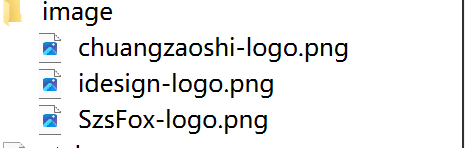

## Qt按钮控件的使用

## 按钮控件（button）

- pushButton （下压按钮）
- ToolButton  （工具按钮）
- RadioButton （选择按钮）
- CheckBox （检查框）
- Command Link Button （命令连接按钮）
- Dialog Button Box （对话框按钮）

### QPushButton

- 引入<QpushButton>类。
- 定义声明信号与槽，和实例化对象
- 连接信号与槽

#### 代码定义声明如下

```
#ifndef MAINWINDOW_H
#define MAINWINDOW_H

#include <QMainWindow>

/* import QPushButton Class*/
#include <QPushButton>

class MainWindow : public QMainWindow
{
    Q_OBJECT

public:
    MainWindow(QWidget *parent = nullptr);
    ~MainWindow();
    /*statement signal*/
    
signals:
    void pushButtonTextChanged();
    
    /*statement slot*/
public slots:
    void changeButtonText();
    void pushButtonClicked();
private:
    /*statement QPushBotton Class*/
    QPushButton *pushButton;
};
#endif // MAINWINDOW_H

```

```
#include "mainwindow.h"

MainWindow::MainWindow(QWidget *parent)
    : QMainWindow(parent)
{
    /*set windows width hight 480 * 800*/
    this->resize(800,480);
    /*create QPushBotton Class*/
    pushButton = new QPushButton(this);
    /*use setText() set text infomation*/
    pushButton->setText("按钮");

    /*signal slot connect signal*/
    connect(pushButton,SIGNAL(clicked()),this,SLOT(pushButtonClicked()));
    connect(this,SIGNAL(pushButtonTextChanged()),this,SLOT(changeButtonText()));
}

MainWindow::~MainWindow()
{
}

void MainWindow::pushButtonClicked(){
    /*use emit send signal*/
    emit pushButtonTextChanged();
}

void MainWindow::changeButtonText(){
    pushButton->setText("按钮被按下");
}
```

### QToolButton

​	QtoolButton和QpushButton的区别是QtoolButton可以带图标。

#### 使用QtoolButton

- 引入<QToolButton>和<QToolBar>类

```
#include <QToolButton>
#include <QToolBar>
```

- 声明QToolButton和QToolBar对象

```
private:
    QToolBar *toolBar;
    QToolButton *toolButton;
```

- 实例化对象

```
toolBar = new QToolBar(this);
```

##### 主程序如下：

```
#include "mainwindow.h"
#include <QApplication>
#include <QStyle>

MainWindow::MainWindow(QWidget *parent)
    : QMainWindow(parent)
{
    this->setGeometry(0,0,800,480);
    /*create QToolBar Class*/
    toolBar = new QToolBar(this);
    toolBar->setGeometry(0,0,800,100);
    /*create style Class,use set icon and Style*/
    QStyle *style = QApplication::style();
    /*use QT's icon*/
    QIcon icon = style->standardIcon(QStyle::SP_TitleBarMenuButton);

    /*create QToolButton Class*/
    toolButton = new QToolButton();
    /*toolButton set icon and text*/
    toolButton->setIcon(icon);
    toolButton->setText("help");

    /*use setToolButtonStyle Function set ToolButton Style,
        set icon is under this button*/
    toolButton->setToolButtonStyle(Qt::ToolButtonTextUnderIcon);
    /*will button add the toolbar*/
    toolBar->addWidget(toolButton);
}

MainWindow::~MainWindow()
{
}

```

### QRadioButton

#### 使用QRadioButton

- 添加资源文件（添加顺序如下）

```
需要添加的项目->Add New->QT->Qt Resource File->Choose->(添加资源文件名称)
双击添加的资源文件.qrc->Add Prefix->前缀添加"/"->Add Files
```

- 添加qss文件

QSS文件使用Qt程序相关联的样式文件，包括GUI的布局，颜色，鼠标的行为，大小和字体。

```
新建添加一个qss文件。
右键点击资源文件.qrc->Qt->Qt Resource File->Choose->填写名称->下一步
```

- 引入<QRadioButton>
- 声明 QRadioButton对象，实例化对象

```
QRadioButton *radioButton1;
QRadioButton *radioButton2;
    
radioButton1 = new QRadioButton(this);
radioButton2 = new QRadioButton(this);
```

- 初始化QRadioButton 状态

```
    radioButton1->setChecked(false);
    radioButton2->setChecked(true);
```

- 编写.qss资源文件

- 引用<QFile>打开资源文件

```
QFile file(":/style.qss");
    /*if file is exist*/
    if(file.exists()){
        file.open(QFile::ReadOnly);
        QString styleSheet = QLatin1String(file.readAll());

        /*set global style*/
        qApp->setStyleSheet(styleSheet);
        file.close();
    }
```

##### 代码示例如下：

.qss

```
QRadioButton{
    spacing:2px;
    color:white;
}

QRadioButton::indicator{
    width:45px;
    height:30px;
}

QRadioButton::indicator:unchecked{
    image: url(:/image/idesign-logo.png);
}

QRadioButton::indicator:checked{
    image: url(:/image/SzsFox-logo.png);
}
```

main.cpp

```
#include "mainwindow.h"

#include <QApplication>
/*import <QFile>*/
#include <QFile>

int main(int argc, char *argv[])
{
    QApplication a(argc, argv);
    QFile file(":/style.qss");
    /*if file is exist*/
    if(file.exists()){
        file.open(QFile::ReadOnly);
        QString styleSheet = QLatin1String(file.readAll());

        /*set global style*/
        qApp->setStyleSheet(styleSheet);
        file.close();
    }
    MainWindow w;
    w.show();
    return a.exec();
}

```

mainwindow.cpp

```
#include "mainwindow.h"

MainWindow::MainWindow(QWidget *parent)
    : QMainWindow(parent)
{
    this->setGeometry(0,0,800,480);
    /*set mainwindows's background-color*/
    this->setStyleSheet("QMainWindow {background-color:rgba(200,50,100,100%);}");

    radioButton1 = new QRadioButton(this);
    radioButton2 = new QRadioButton(this);

    /*set radiobutton's position and size*/
    radioButton1->setGeometry(300,200,100,50);
    radioButton2->setGeometry(400,200,100,50);

    radioButton1->setText("Button1");
    radioButton2->setText("Button2");

    /*set radioButton's init status*/
    radioButton1->setChecked(false);
    radioButton2->setChecked(true);

}

```

### QCheckBox 

QCheckBox是三态选择框，可以有三种状态。

#### QCheckBox 使用

- 添加资源文件



- 实例化QCheckBox,初始化QCheckBox状态。

```
 /*set checkBox status*/
 checkBox->setText("初始化状态为Checked");
 checkBox->setCheckState(Qt::Checked);
 /*open three status mode*/
 checkBox->setTristate();
 /*connect slot*/
 connect(checkBox,SIGNAL(stateChanged(int)),this,SLOT(checkBoxStatusChanged(int)));
```

- 实现Slot槽函数

```
void MainWindow::checkBoxStatusChanged(int status)
```

- 编写.qss文件

##### 代码示例如下

mainwindow.cpp

```
#include "mainwindow.h"

MainWindow::MainWindow(QWidget *parent)
    : QMainWindow(parent)
{
    this->setGeometry(0,0,800,480);
    this->setStyleSheet("QMainWindow {background-color:rgba(100,100,100,100%);}");

    checkBox = new QCheckBox(this);
    checkBox->setGeometry(350,200,250,50);


    /*set checkBox status*/
    checkBox->setText("初始化状态为Checked");
    checkBox->setCheckState(Qt::Checked);
    /*open three status mode*/
    checkBox->setTristate();
    /*connect slot*/
    connect(checkBox,SIGNAL(stateChanged(int)),this,SLOT(checkBoxStatusChanged(int)));
}

MainWindow::~MainWindow()
{
}

void MainWindow::checkBoxStatusChanged(int status){
    switch(status){
    case Qt::Checked:
        checkBox->setText("Checked status");
        break;
    case Qt::Unchecked:
        checkBox->setText("Unchecked status");
        break;
    case Qt::PartiallyChecked:
        checkBox->setText("PartiallyChecked status");
        break;
    default:
        break;
    }
}
```

main.cpp

```
#include "mainwindow.h"

#include <QApplication>
#include <QFile>

int main(int argc, char *argv[])
{
    QApplication a(argc, argv);
    QFile file(":/style.qss");
    if(file.exists()){
        file.open(QFile::ReadOnly);
        QString styleSheet = QLatin1String(file.readAll());
        /*set global style*/
        qApp->setStyleSheet(styleSheet);
        file.close();
    }
    MainWindow w;
    w.show();
    return a.exec();
}

```

.qss

```
QCheckBox{
    spacing:5px;
    color:white;
}

QCheckBox::indicator{
    width:50px;
    height:50px;
}

QCheckBox::indicator:enabled:unchecked{
    image: url(:/image/chuangzaoshi-logo.png);
}

QCheckBox::indicator:enabled:checked{
    image: url(:/image/idesign-logo.png);
}

QCheckBox::indicator:enabled:indeterminate{
    image: url(:/image/SzsFox-logo.png);
}
```

### QCommandLinkButton

QCommandLinkButton命令链接按钮 和QRadioButton相似，用于在互斥选项中选择一项，携带一个箭头图标。

#### QCommandLinkButton使用

- 引用<QCommandLinkButton> ,<QDesktopServices>,<QUrl>
- 声明和实例化QCommandLinkButton

```
 private:
    QCommandLinkButton *CommandLinkButton;
 CommandLinkButton = new QCommandLinkButton(
    "点击打开目录",this);
```

- 实现信号和槽之间的连接

```
connect(CommandLinkButton,SIGNAL(clicked()),this,SLOT(CommandLinkButtonClicked()));
```

- 实现CommandLinkButtonClicked槽函数

##### 代码实现如下

```
#include "mainwindow.h"
/*import desk server,open system folder*/
#include <QDesktopServices>
/*import QUrl*/
#include <QUrl>

MainWindow::MainWindow(QWidget *parent)
    : QMainWindow(parent)
{
    this->setGeometry(0,0,800,480);

    CommandLinkButton = new QCommandLinkButton(
    "点击打开目录",this);

    CommandLinkButton->setGeometry(300,200,250,60);
    connect(CommandLinkButton,SIGNAL(clicked()),this,SLOT(CommandLinkButtonClicked()));

}

MainWindow::~MainWindow()
{
}

void MainWindow::CommandLinkButtonClicked(){
    /*call system server open catalogue*/
    QDesktopServices::openUrl(QUrl("D:/emulate"));
}
```

### QDialogButtonBox

#### QDialogButtonBox的使用

​	QDialogButtonBox 允许开发人员向其添加按钮，并将自动使用适合用户桌面环境的布局  。我们可以实现自定义按钮。

- 引入<QDialogButtonBox>
- 声明QDialogButtonBox 对象和QpushButton对象

```
private:
    QDialogButtonBox *dialogButtonBox;
    QPushButton *PushButton;
private slots:
    void DialogButtonBoxClicked(QAbstractButton *);
```

- 实例化QDialogButtonBox对象

```
dialogButtonBox = new QDialogButtonBox(this);
    dialogButtonBox->setGeometry(300,200,200,30);

    dialogButtonBox->addButton(QDialogButtonBox::Cancel);
    dialogButtonBox->button(QDialogButtonBox::Cancel)->setText("取消");
```

- 实例化QPushButton

```
PushButton = new QPushButton(tr("自定义"));
```

- 将QPushButton添加到QDialogButtonBox里面，并且实现信号和槽的连接。

```
/*will pushbutton add to dialogbuttonBox,and set buttonRole is ActionRole*/
    dialogButtonBox->addButton(PushButton,QDialogButtonBox::ActionRole);
    connect(dialogButtonBox,SIGNAL(clicked(QAbstractButton *)),this,SLOT(DialogButtonBoxClicked(QAbstractButton *)));
```

- 槽函数的实现

##### 代码示例如下

```
#include "mainwindow.h"
#include <QDebug>

MainWindow::MainWindow(QWidget *parent)
    : QMainWindow(parent)
{
    this->setGeometry(0,0,800,480);
    dialogButtonBox = new QDialogButtonBox(this);
    dialogButtonBox->setGeometry(300,200,200,30);

    dialogButtonBox->addButton(QDialogButtonBox::Cancel);
    dialogButtonBox->button(QDialogButtonBox::Cancel)->setText("取消");

    PushButton = new QPushButton(tr("自定义"));
    /*will pushbutton add to dialogbuttonBox,and set buttonRole is ActionRole*/
    dialogButtonBox->addButton(PushButton,QDialogButtonBox::ActionRole);
    connect(dialogButtonBox,SIGNAL(clicked(QAbstractButton *)),this,SLOT(DialogButtonBoxClicked(QAbstractButton *)));

}
void MainWindow::DialogButtonBoxClicked(QAbstractButton *button){
    if(button == dialogButtonBox->button((QDialogButtonBox::Cancel))){
        qDebug() <<"clicked Cancel"<<endl;
    }else if(button == PushButton){
        qDebug() <<"clicked self button"<<endl;
    }else{

    }
}
```

