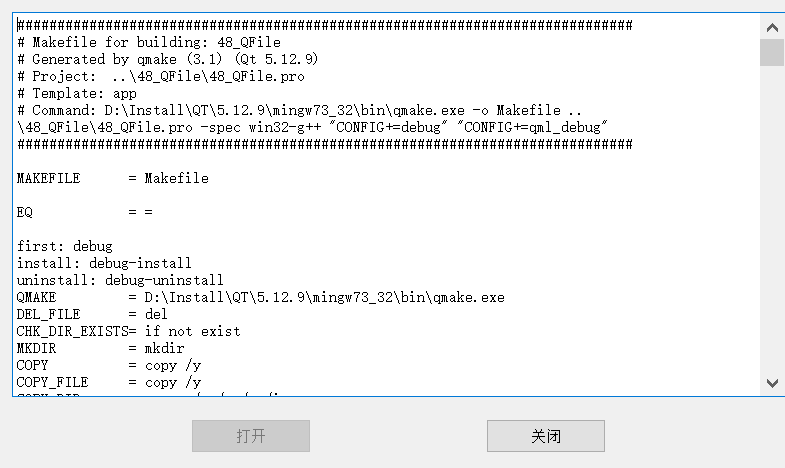

## Qt文件读写

### QFile

QFile 是一个读写文本、二进制文件和资源的 I/O 设备。 QFile 可以自己使用，也可以更方便地与 QTextStream 或 QDataStream 一起使用。  

#### QFile常用操作函数

- exists()检查文件是否存在  
- remove()删除文件  
- open()打开文件  
- close()关闭文件  
- flush()刷新文件  
- read()读取文件
- write()写入文件

通常使用 QDataStream 或 QTextStream 读写数据，但也可以调用 QIODevice 继承的函数 read()、readLine()、 readAll()、 write()。 QFile 还继承 getChar()、 putChar()和 ungetChar()，它们一次只处理一个字符。文件的大小由 size()返回。可以使用 pos()获取当前文件位置，也可以使用 seek()移动到新的文件位置。如果已经到达文件的末尾，则 atEnd()返回 true。  

QFile::open()函数打开文件时需要传递 QIODevice::OpenModeFlag 枚举类型的参数，决定文件以什么方式打开， QIODevice::OpenModeFlag 类型的主要取值如下  

- QIODevice::ReadOnly：以只读方式打开文件，用于载入文件。  
- QIODevice::WriteOnly：以只写方式打开文件，用于保存文件。
- QIODevice::ReadWrite：以读写方式打开。  
- QIODevice::Append：以添加模式打开，新写入文件的数据添加到文件尾部。  
- QIODevice::Truncate：以截取方式打开文件，文件原有的内容全部被删除。
- QIODevice::Text：以文本方式打开文件，读取时“\n”被自动翻译为换行符，写入时字符串结束符会自动翻译为系统平台的编码，如 Windows 平台下是“\r\n”。    

##### 代码示例

```
#include "mainwindow.h"
#include <QFileDialog>
#include <QDebug>

MainWindow::MainWindow(QWidget *parent)
    : QMainWindow(parent)
{
    this->setGeometry(0,0,800,480);

    textEdit = new QTextEdit();
    vBoxLayout = new QVBoxLayout();
    hBoxLayout = new QHBoxLayout();
    vWidget = new QWidget();
    hWidget = new QWidget();
    openFileButton = new QPushButton();
    closeFileButton = new QPushButton();
    /*设置两个按钮大小*/
    openFileButton->setMaximumHeight(50);
    openFileButton->setMaximumWidth(120);
    closeFileButton->setMaximumHeight(50);
    closeFileButton->setMaximumWidth(120);

    openFileButton->setText("打开");
    closeFileButton->setText("关闭");

    /*将按钮设置为不可用*/
    closeFileButton->setEnabled(false);
    /*水平布局*/
    hBoxLayout->addWidget(openFileButton);
    hBoxLayout->addWidget(closeFileButton);
    hWidget->setLayout(hBoxLayout);
    /*垂直布局*/
    vBoxLayout->addWidget(textEdit);
    vBoxLayout->addWidget(hWidget);
    vWidget->setLayout(vBoxLayout);
    /*设置vWidget居中*/
    setCentralWidget(vWidget);

    connect(openFileButton,SIGNAL(clicked()),this,SLOT(openFile()));
    connect(closeFileButton,SIGNAL(clicked()),this,SLOT(closeFile()));
}

bool MainWindow::openFile(){
    QString file_name = QFileDialog::getOpenFileName(this);

    /*指向文件*/
    file.setFileName(file_name);
    /*判断文件是否存在*/
    if(!file.exists()){
        return false;
    }
    /*打开文件*/
    if(!file.open(QIODevice::ReadOnly | QIODevice::Text)){
        return false;
    }
    /*读取文本到textEdit*/
    textEdit->setPlainText(file.readAll());
    /*设置打开按钮不可用*/
    openFileButton->setEnabled(false);
    /*设置关闭按钮可用*/
    closeFileButton->setEnabled(true);
    file.close();
    return true;
}

void MainWindow::closeFile(){
    /*检测打开按钮openFileButton是否可用,不可用时表示打开了文件*/
    if(!openFileButton->isEnabled()){
        /*获取textEdit的文本内容*/
        QString str = textEdit->toPlainText();
        if(!file.open(QIODevice::WriteOnly | QIODevice::Text)){
            return;
        }
        QByteArray strBytes = str.toUtf8();
        file.write(strBytes,strBytes.length());

        textEdit->clear();
        file.close();

        /*重新设置按钮属性*/
        openFileButton->setEnabled(true);
        closeFileButton->setEnabled(false);
    }
}
```

##### ui示例



### QTextStream

QTextStream 类为读写文本提供了一个方便的接口，常与 QFile 结合使用。  可以使用 C++的操作符“<<”和“>>” (流提取运算符和流插入运算符)进行操作流了  


##### 代码QFile代码类似，代码部分示例

```
/*使用文本流读取文件*/
QTextStream stream(&file);

/*读取文本到textEdit*/
textEdit->setPlainText(stream.readAll());
```

```
QTextStream stream(&file);
/*获取textEdit的文本内容，转换成字符串*/
QString str = textEdit->toPlainText();
/*使用流提取运算符*/
stream<<str;
```

##### ui同QFile一致

