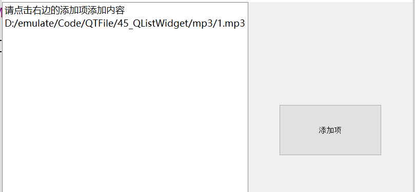
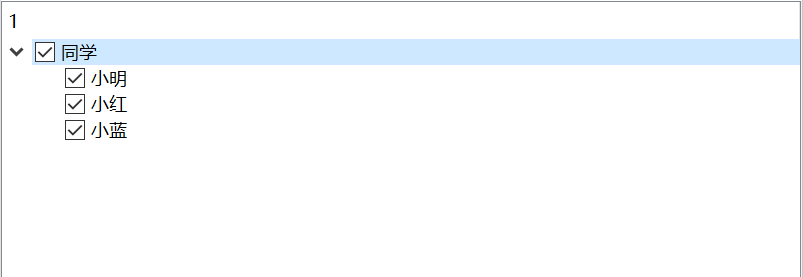
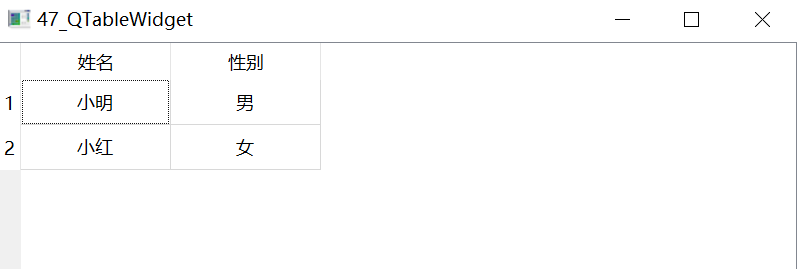

## Qt项目控件组

### QListWidget

QListWidget 类提供了一个基于项的列表小部件。 QListWidget 是一个便捷的类，它提供了一个类似于 QListView（下一小节将讲到）提供的列表视图，但是提供了一个用于添加和删除项目的基于项目的经典接口。 QListWidget 使用内部模型来管理列表中的每个 QListWidgetItem。  

##### 代码示例

```
#include "mainwindow.h"
#include <QFileDialog>

MainWindow::MainWindow(QWidget *parent)
    : QMainWindow(parent)
{
    this->setGeometry(0,0,800,480);
    listWidget = new QListWidget(this);
    /*设置listWidget的大小*/
    listWidget->setGeometry(0,0,480,480);
    listWidget->addItem("请点击右边的添加项添加内容");
    button = new QPushButton(this);
    button->setGeometry(540,200,200,100);
    button->setText("添加项");

    connect(button,SIGNAL(clicked()),this,SLOT(buttonClicked()));
}

void MainWindow::buttonClicked(){
    /*调用系统窗口打开文件，过滤文件名*/
    QString file_name = QFileDialog::getOpenFileName(this,
                                                     tr("添加项"),
                                                     "",
                                                     tr("Files(*.mp3)"));
    if(file_name != NULL){
        listWidget->addItem(file_name);
    }
}
```

##### ui示例



### QTreeWidget

QTreeWidget 类提供了一个使用预定义树模型的树视图。QTreeWidget 类是一个便捷的类，它提供了一个标准的树小部件，具有一个类似于 qt3 中的 QListView 类所使用的基于项目的经典接口。该类基于 Qt 的模型/视图体系结构，并使用默认模型来保存项，每个项都是 QTreeWidgetItem。  

##### 代码示例

```
#include "mainwindow.h"

MainWindow::MainWindow(QWidget *parent)
    : QMainWindow(parent)
{
    this->setGeometry(0,0,800,480);

    treeWidget = new QTreeWidget(this);
    this->setCentralWidget(treeWidget);

    /*清空列表*/
    treeWidget->clear();
    /*实例化顶层树节点*/
    upItem = new QTreeWidgetItem(treeWidget);
    upItem->setText(0,"同学");
    upItem->setFlags(Qt::ItemIsUserCheckable|
                     Qt::ItemIsEnabled|
                     Qt::ItemIsSelectable);
    /*树节点设置为未选中*/
    upItem->setCheckState(0,Qt::Unchecked);

    QList <QString>  strList;
    strList<<"小明"<<"小红"<<"小蓝";
    /*在顶层节点下面实例化3个子节点*/
    for(int i = 0;i < 3;i ++){
        subItem[i] = new QTreeWidgetItem(upItem);
        subItem[i]->setText(0,strList[i]);
        /*设置子节点的属性为用户可选，项开启，项可选*/
        subItem[i]->setFlags(Qt::ItemIsUserCheckable|
                             Qt::ItemIsEnabled|
                             Qt::ItemIsSelectable);
        /*设置子节点的状态为未选中*/
        subItem[i]->setCheckState(0,Qt::Unchecked);
    }

    connect(treeWidget,SIGNAL(itemChanged(QTreeWidgetItem*,int)),this,SLOT(treeItemChanged(QTreeWidgetItem*,int)));

}
/*子节点跟新处理函数*/
void MainWindow::subItemHandle(QTreeWidgetItem *item){
    /*获取节点的上层节点*/
    QTreeWidgetItem *parentItem = item->parent();
    if(parentItem == NULL){
        return;
    }
    /*初始化选中的数目为0,下面根据selectCount来判断树节点的状态*/
    int selectCount = 0;
    /*获取子节点的总数*/
    int childCount = parentItem->childCount();
    for(int i = 0;i < childCount;i ++){
        QTreeWidgetItem *childItem = parentItem->child(i);
        /*判断当前节点的状态是否为选中状态，如果是则加1*/
        if(childItem->checkState(0) == Qt::Checked){
            selectCount ++;
        }
    }

    /*根据selectCount来判断树节点的状态*/
    /*当选中的子节点小于或等于0时，则设置树节点为未选中的状态*/
    if(selectCount <= 0){
        /*设置为未选中状态*/
        parentItem->setCheckState(0,Qt::Unchecked);
    }else if(selectCount > 0 && selectCount < childCount){
        /*设置为半选中状态*/
        parentItem->setCheckState(0,Qt::PartiallyChecked);
    }else if(selectCount == childCount){
        /*设置为全选中状态*/
        parentItem->setCheckState(0,Qt::Checked);
    }else{

    }

}

void MainWindow::treeItemChanged(QTreeWidgetItem *item,int value){
    (void) value;
    /*获取子节点个数*/
    int count = item->childCount();
    /*如果顶层节点被选中*/
    if(Qt::Checked == item->checkState(0)){
        /*若选中的项是树节点,count会大于0，否则选中的项是子节点*/
        if(count > 0){
            for(int i = 0;i < count;i ++){
                item->child(i)->setCheckState(0,Qt::Checked);
            }
        }else{
            /*子节点处理*/
            subItemHandle(item);
        }
        /*如果顶层节点取消选中*/
    }else if(Qt::Unchecked == item->checkState(0)){
        if(count > 0){
            /*如果选中的是树节点*/
            for(int i = 0;i < count;i ++){
                item->child(i)->setCheckState(0,Qt::Unchecked);
            }
        }else{
            subItemHandle(item);
        }
    }
}
```

##### ui示例



### QTableWidget

QTableWidget 类提供了一个带有默认模型的基于项的表视图。表小部件为应用程序提供标准的表显示工具。  

##### 代码示例

```
#include "mainwindow.h"

MainWindow::MainWindow(QWidget *parent)
    : QMainWindow(parent)
{
    this->setGeometry(0,0,800,480);
    tableWidget = new QTableWidget();
    this->setCentralWidget(tableWidget);
    /*设置列数*/
    tableWidget->setColumnCount(2);
    /*设置行数*/
    tableWidget->setRowCount(2);
    /*使用标签设置水平标题标签*/
    tableWidget->setHorizontalHeaderLabels(QStringList()<<"姓名"<<"性别");
    QList <QString> strList;
    strList<<"小明"<<"小红"<<"男"<<"女";
    for(int i = 0;i < 4;i ++){
        tableWidgetItem[i] = new QTableWidgetItem();
        tableWidgetItem[i]->setText(strList[i]);
        tableWidgetItem[i]->setTextAlignment(Qt::AlignCenter);
    }
    /*插入数据表的index，一个二位数组数据*/
    tableWidget->setItem(0,0,tableWidgetItem[0]);
    tableWidget->setItem(1,0,tableWidgetItem[1]);
    tableWidget->setItem(0,1,tableWidgetItem[2]);
    tableWidget->setItem(1,1,tableWidgetItem[3]);
}
```

##### ui示例

