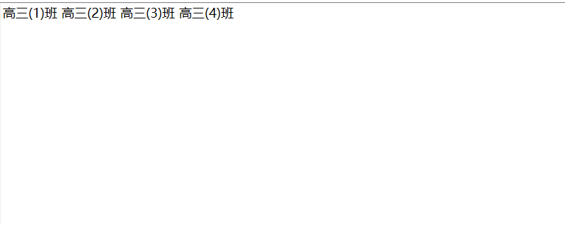
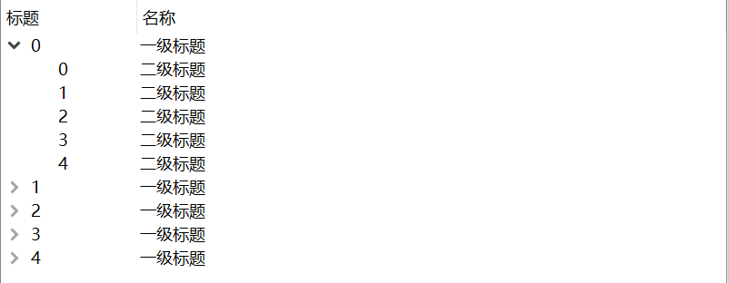
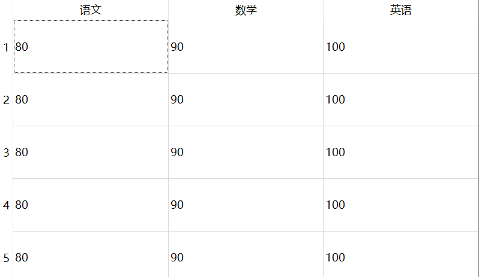
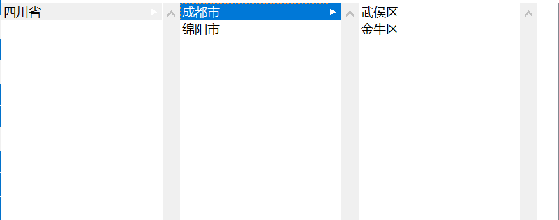
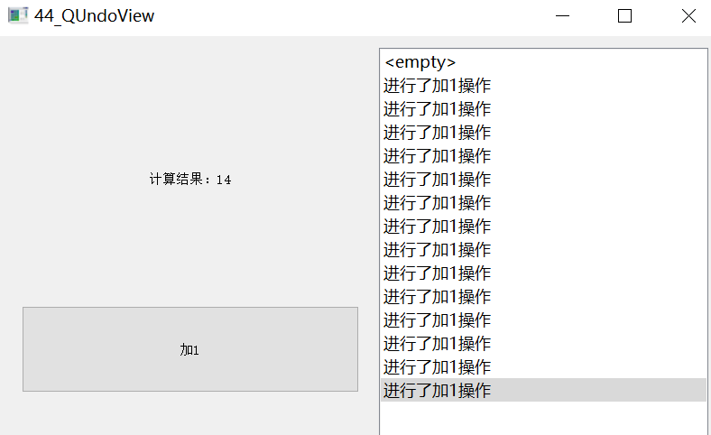

## Qt项目视图组

### QListView

QListView 类提供模型上的列表或图标视图。  

QListView 以简单的非分层列表或图标集合的形式显示存储在模型中的项。  

QT 提供了一些现成的 models 用于处理数据项（这些是 Qt 处理数据模型的精华，如果用到Qt 数据模型，下面这些是经常要用到的）：  

- QStringListModel 用于存储简单的 QString 列表。  
- QStandardItemModel 管理复杂的树型结构数据项，每项都可以包含任意数据。  
- QDirModel 提供本地文件系统中的文件与目录信息。  
- QSqlQueryModel, QSqlTableModel,QSqlRelationTableModel 用来访问数据库。  

##### 代码示例

```
#include "mainwindow.h"

MainWindow::MainWindow(QWidget *parent)
    : QMainWindow(parent)
{
    this->setGeometry(0,0,800,480);
    listView = new QListView(this);
    this->setCentralWidget(listView);

    QStringList strList;
    strList<<"高三(1)班"<<"高三(2)班"<<"高三(3)班"<<"高三(4)班";

    /*实例化字符串模型*/
    stringListModel = new QStringListModel(strList);
    /*向表中插入一段数据*/
    listView->setModel(stringListModel);
    /*设置视图为图标模式*/
    listView->setViewMode(QListView::IconMode);
    /*设置为不可拖动*/
    listView->setDragEnabled(false);

}
```

##### ui示例



###  QTreeView

QTreeView 类提供树视图的默认模型/视图实现。 QTreeView 实现了模型项的树表示。  要使一个 QTreeView 能够显示数据，需要构造一个 model 并设置 QTreeView。 Qt 提供了一些类型的 Model，其中最常用的就是这个
QStandardItemModel 类，一般可以满足大部分需求。  另外，表头的内容也由这个 model管理，setHorizontalHeaderLabels  函数可以设置共有多少列、每列文字。一级标题直接使用 appendRow方法添加到 model 上，次级标题则是添加到第一个父级标题上，依次构成父子关系树。  

##### 代码示例

```
#include "mainwindow.h"
#include <QStandardItem>
#include <QStandardItemModel>

MainWindow::MainWindow(QWidget *parent)
    : QMainWindow(parent)
{
    this->setGeometry(0,0,800,480);
    treeView = new QTreeView(this);

    this->setCentralWidget(treeView);

    /*构建modle*/
    QStandardItemModel *sdiModule = new QStandardItemModel(treeView);
    sdiModule->setHorizontalHeaderLabels(QStringList()<<QStringLiteral("标题")
                                         << QStringLiteral("名称"));
    for(int i = 0;i < 5;i ++){
        /*一级标题*/
        QList <QStandardItem *> items1;
        QStandardItem *item1 = new QStandardItem(QString::number(i));
        QStandardItem *item2 = new QStandardItem(QStringLiteral("一级标题"));
        /*添加项1*/
        items1.append(item1);
        /*添加项2*/
        items1.append(item2);
        /*将items1添加到sdiModule*/
        sdiModule->appendRow(items1);
        for(int j = 0;j < 5;j ++){
            /*在一级标题后面插入二级标题*/
            QList <QStandardItem *> items2;
            QStandardItem * item3 = new QStandardItem(QString::number(j));
            QStandardItem * item4 = new QStandardItem(QStringLiteral("二级标题"));

            items2.append(item3);
            items2.append(item4);
            item1->appendRow(items2);
        }

    }
    treeView->setModel(sdiModule);
}
```

##### ui示例



### QTableView

QTableView 类提供了表视图的默认模型/视图实现。 QTableView 实现了一个表视图，用于显示来自模型的项。  Qt 提供了一些类型的 Model，其中最常用的就是这个QStandardItemModel 类，一般可以满足大部分需求。另外，表头的内容也由这个 model 管理，setHorizontalHeaderLabels 函数可以设置共有多少列、每列文字。  

##### 代码示例

```
#include "mainwindow.h"
#include <QStandardItemModel>
#include <QHeaderView>

MainWindow::MainWindow(QWidget *parent)
    : QMainWindow(parent)
{
    this->setGeometry(0,0,800,480);

    tableView = new QTableView(this);
    this->setCentralWidget(tableView);

    /*显示网格线*/
    tableView->setShowGrid(true);

    QStandardItemModel *model = new QStandardItemModel();
    QStringList lables = QObject::tr("语文,数学,英语").simplified().split(",");
    /*设置水平头标签*/
    model->setHorizontalHeaderLabels(lables);
    /*model插入内容*/
    QStandardItem * item = 0;
    for(int i = 0;i < 5;i ++){
        item = new  QStandardItem("80");
        model->setItem(i,0,item);
        item = new  QStandardItem("90");
        model->setItem(i,1,item);
        item = new  QStandardItem("100");
        model->setItem(i,2,item);
    }
    /*将model设置给tableView*/
    tableView->setModel(model);
    /*平均分列*/
    tableView->horizontalHeader()->setSectionResizeMode(QHeaderView::Stretch);
    /*平均分行*/
    tableView->verticalHeader()->setSectionResizeMode(QHeaderView::Stretch);
}
```

##### ui示例



### QColumnView

QColumnView 在许多 QListViews 中显示一个模型，每个 QListViews 对应树中的每个层次结构。这有时被称为级联列表。 QColumnView 类是模型/视图类之一，是 Qt 模型/视图框架的一部分。   

##### 代码示例

```
#include "mainwindow.h"
#include <QStandardItem>

MainWindow::MainWindow(QWidget *parent)
    : QMainWindow(parent)
{
    this->setGeometry(0,0,800,480);

    columnView = new QColumnView(this);
    this->setCentralWidget(columnView);

    QStandardItemModel *model = new QStandardItemModel(this);
    /*省份*/
    QStandardItem *province = new QStandardItem("四川省");
    /*城市*/
    QStandardItem *city1 = new QStandardItem("成都市");
    QStandardItem *city2 = new QStandardItem("绵阳市");
    /*将城市添加到省份*/
    province->appendRow(city1);
    province->appendRow(city2);

    /*区域*/
    QStandardItem *area1 = new QStandardItem("武侯区");
    QStandardItem *area2 = new QStandardItem("金牛区");
    /*将区域添加到城市*/
    city1->appendRow(area1);
    city1->appendRow(area2);

    model->appendRow(province);
    columnView->setModel(model);
}
```

##### ui示例



### QundoView

QUndoView 类显示 QUndoStack 的内容。 QUndoView 是一个QListView，它显示在撤销堆栈上推送的命令列表。总是选择最近执行的命令。选择不同的命令会导致调用QUndoStack::setIndex()，将文档的状态向后或向前滚动到新命令。可以使用setStack()显式地设置堆栈。  

##### 代码示例

mainWindow.cpp

```
#include "mainwindow.h"
#include <QDebug>

MainWindow::MainWindow(QWidget *parent)
    : QMainWindow(parent)
{
    /* 设置主窗体显示的位置与大小 */
    this->setGeometry(0, 0, 800, 480);

    /* 实例一个水平布局，用于左侧按钮区域与右侧历史记录面板 */
    hLayout = new QHBoxLayout();

    /* 实例一个水平布局，用于左侧标签与按钮 */
    vLayout = new QVBoxLayout();

    /* 主Widget, 因为MainWindow自带一个布局，
     * 我们要新建一个Widget容纳新布局
     */
    mainWidget = new QWidget();

    /* 用于存放命令行栈 */
    undoStack = new QUndoStack(this);

    /* 用于容纳左侧标签与按钮布局 */
    widget = new QWidget();

    /* 历史记录面板实例化 */
    undoView = new QUndoView(undoStack);

    /* 实例化一个按钮，用于加一操作 */
    pushButton = new QPushButton();

    /* 标签，用于显示计算结果 */
    label = new QLabel();

    /* 设置widget的大小 */
    widget->setMinimumSize(400, 480);

    /* 将两个widget添加到水平布局 */
    hLayout->addWidget(widget);
    hLayout->addWidget(undoView);

    /* 初始化count的值 */
    count = 0;

    /* 显示初始化计算结果 */
    label->setText("计算结果：" + QString::number(count));
    label->setAlignment(Qt::AlignCenter);

    /* 左侧布局 */
    vLayout->addWidget(label);
    vLayout->addWidget(pushButton);

    /* 左侧布局控件的高度设置 */
    label->setMaximumHeight(this->height() / 5);
    pushButton->setMaximumHeight(this->height() / 5);

    /* 按钮文件设置 */
    pushButton->setText("加1");

    /* 设置widget的布局为vLayout */
    widget->setLayout(vLayout);

    /* 将主窗体的布局设置为hLayout */
    mainWidget->setLayout(hLayout);

    /* 设置mainWidget为主窗体的居中widget */
    this->setCentralWidget(mainWidget);

    /* 信号槽连接，按钮点击，执行加一操作 */
    connect(pushButton, SIGNAL(clicked()), this,
            SLOT(pushButtonClieked()));

    /* 信号槽连接，历史记录项index发生变化，显示count大小 */
    connect(undoStack, SIGNAL(indexChanged(int) ),
            this, SLOT(showCountValue(int)));
}

/* 入栈操作会自动调用addCommand的redo */
void MainWindow::pushButtonClieked()
{
    /* 变量值加一 */
    count++;

    /* value指向count的地址 */
    int *value = &count;

    /* 用重写的addCommand类实例化 */
    QUndoCommand *add = new addCommand(value);

    /* 入栈 */
    undoStack->push(add);
}

void MainWindow::showCountValue(int)
{
    /* 标签用于显示计算结果 */
    label->setText("计算结果：" + QString::number(count));
}
```


command.h

```
#ifndef COMMAND_H
#define COMMAND_H

#include <QUndoCommand>
#include <QObject>

class addCommand : public QUndoCommand
{
public:
    addCommand(int *value, QUndoCommand* parent = 0);
    ~addCommand();

    /* 重写重做与撤回方法 */
    void redo() override;
    void undo() override;

private:
    /* 新的count */
    int *new_count;

    /* 旧的count */
    int old_count;
};

#endif // COMMAND_H

```

command.cpp

```
#include "command.h"
#include <QDebug>

addCommand::addCommand(int *value, QUndoCommand *parent)
{
    /* 使用Q_UNUSED,避免未使用的数据类型 */
    Q_UNUSED(parent);

    /* undoView显示的操作信息 */
    setText("进行了加1操作");

    /* value的地址赋值给new_count */
    new_count = value;

    /* 让构造函数传过来的*new_count的值赋值给old_count */
    old_count = *new_count;
}

/* 执行stack push时或者重做操作时会自动调用 */
void addCommand::redo()
{
    /* 重新赋值给new_count */
    *new_count = old_count;

    /* 打印出*new_count的值 */
    qDebug()<<"redo:"<<*new_count<<endl;
}

/* 回撤操作时执行 */
void addCommand::undo()
{
    /* 回撤操作每次应减一 */
    (*new_count)--;

    /* 打印出*new_count的值 */
    qDebug()<<"undo:"<<*new_count<<endl;
}

addCommand::~addCommand()
{

}
```

##### ui示例

