# sfud移植使用

### sfud的移植

1、点击链接下载sufd串行flash通用库。

[GitHub - armink/SFUD: An using JEDEC's SFDP standard serial (SPI) flash universal driver library | 一款使用 JEDEC SFDP 标准的串行 (SPI) Flash 通用驱动库](https://github.com/armink/SFUD)

2、下载完成之后获取sfud文件夹，将sfud文件夹拷贝到工程目录下

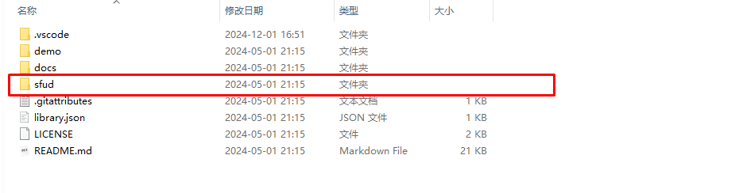

3、填充sfud_port.c接口文件

- 找到sfud_port.c文件

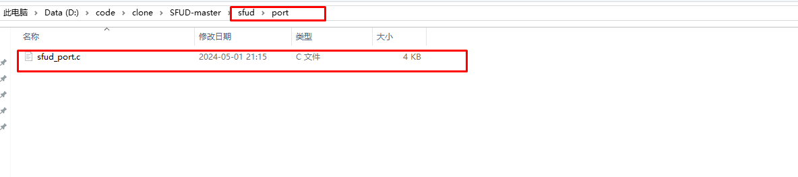

- 填充sfud_port.c文件里面的spi_write_read读写接口

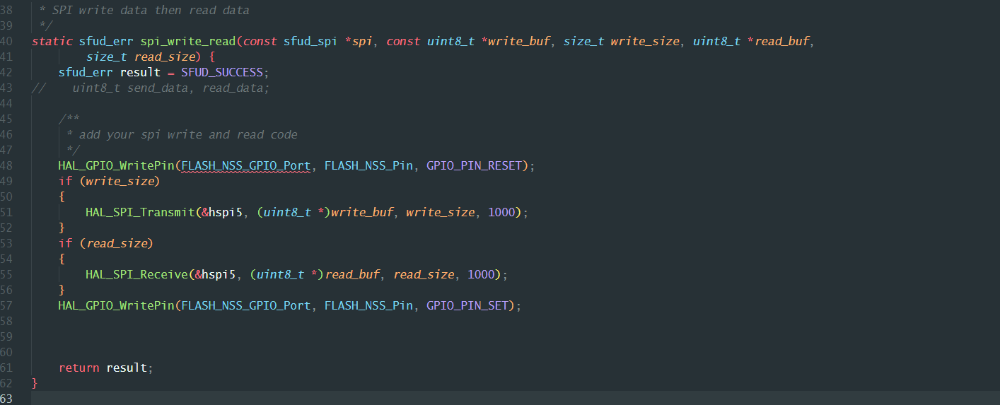

4、移植完成之后可以进行测试

如果是sfud支持的flash库，调用sfud_init()函数初始化flash,可以打印如下日志。

```
sfud_init();
```

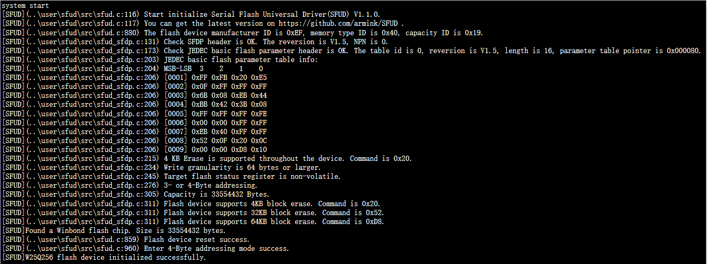

## sfud的文件系统的移植

移植文件系统之前确保sufd正常工作。

1、找到并且打开FatFs/src文件夹下面的discio.c文件。

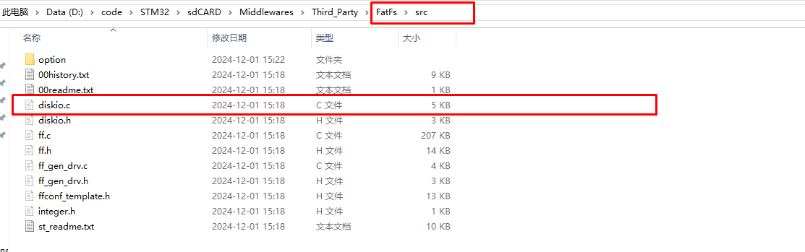

2、实现FATFS的读写操作函数。

- FATFS初始化函数的实现。

  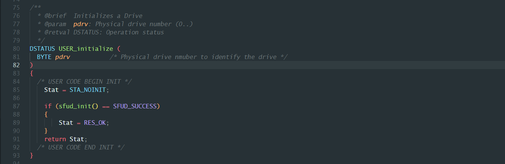

- FATFS读函数的实现

  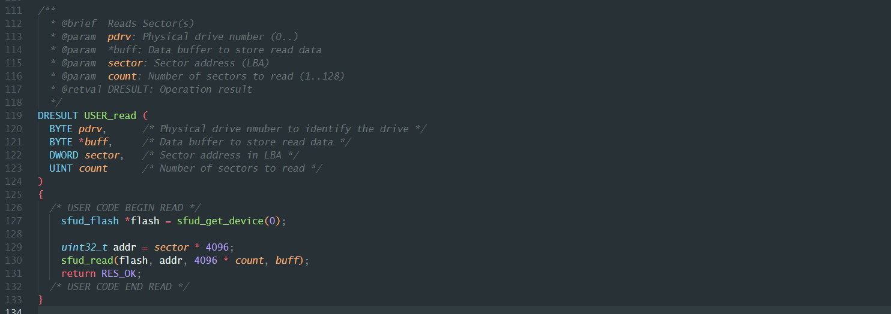

- FATFS写函数的实现

  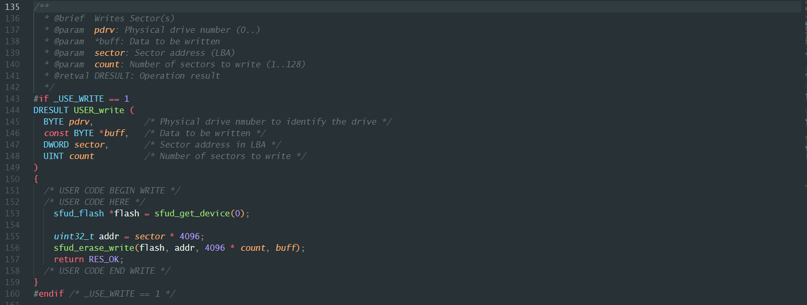

- FATFS函数功能函数的实现

  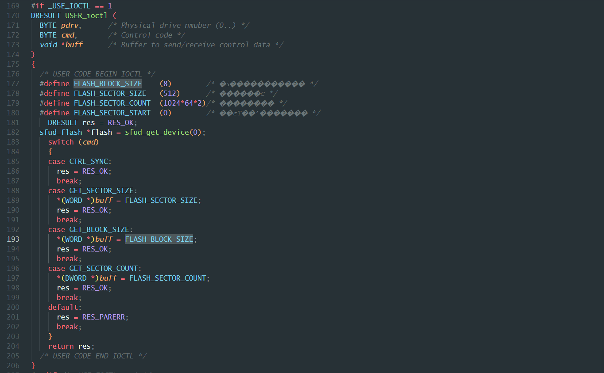

3、完成上面几步，基本配置完成FATFS文件系统。

4、如果文件系统挂载不上的话（确保sfud是正常使用的情况下），可以判断一下FLASH是否格式化，如果没有的话使用f_mkfs（）函数格式化文件系统。

```
//格式化为FATFS格式，使用静态内存格式化，格式化磁盘编号为0
static BYTE work[_MAX_SS];
f_mkfs("0:",FM_FAT32, 0, work, sizeof(work));
```

## SFUD的函数基本使用

1、SFUD的初始化函数

- 初始化全部flash对象

  ```
  sfud_err sfud_init(void);
  ```

- 初始化单个flash对象

  ```
  sfud_err sfud_device_init(sfud_flash *flash);
  
  sfud_flash sfud_norflash0 = {
          .name = "norflash0",
          .spi.name = "SPI1",
          .chip = { "W25Q64FV", SFUD_MF_ID_WINBOND, 0x40, 0x17, 8L * 1024L * 1024L, SFUD_WM_PAGE_256B, 4096, 0x20 } };
  sfud_device_init(&sfud_norflash0);
  ```

2、找到指定的flash对象函数

```
sfud_flash *sfud_get_device(size_t index);
```

3、获取flash对象个数

```
size_t sfud_get_device_num(void);
```

4、获取flash初始化静态表

如果使用表的方式初始化，调用函数获取表的首地址。

```
const sfud_flash *sfud_get_device_table(void);
```

5、sfud的读写擦除函数

- sfud读函数

  ```
  sfud_err sfud_read(const sfud_flash *flash, uint32_t addr, size_t size, uint8_t *data);
  ```

- sfud写函数

  ```
  sfud_err sfud_write(const sfud_flash *flash, uint32_t addr, size_t size, const uint8_t *data);
  ```

- sfud擦除函数

  ```
  sfud_err sfud_erase(const sfud_flash *flash, uint32_t addr, size_t size);
  ```

- sfud写擦除函数

  ```
  sfud_err sfud_erase_write(const sfud_flash *flash, uint32_t addr, size_t size, const uint8_t *data);
  ```

6、获取寄存器状态

```
sfud_err sfud_read_status(const sfud_flash *flash, uint8_t *status);
```

## SFUD的不支持的FLASH配置

如果sfud不支持的flash可以通过配置表来手动支持。

修改SFUD_FLASH_CHIP_TABLE和SFUD_MF_TABLE来支持。

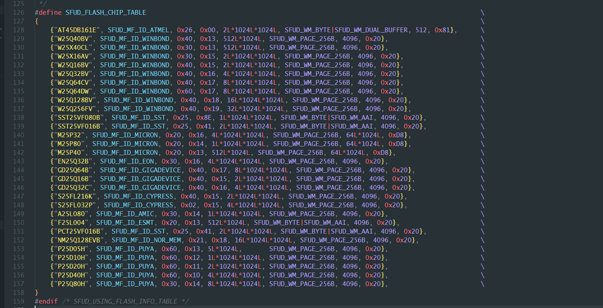


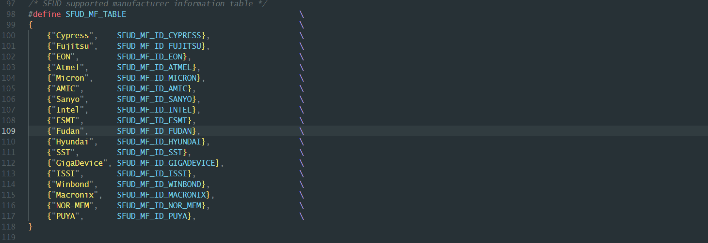