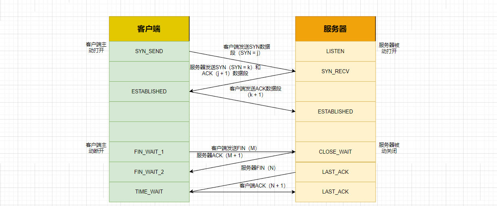

# 深入理解TCP和UDP协议及两者的区别

## TCP协议

 	**位于传输层**， 提供**可靠的字节流服务**。所谓的字节流服务（Byte Stream Service） 是指， 为了方便传输， 将大块数据分割成以报文段（segment） 为单位的数据包进行管理。 而可靠的传输服务是指， 能够把数据准确可靠地传给对方。 即TCP 协议为了更容易传送大数据才把数据分割， 而且 TCP 协议能够确认数据最终是否送达到对方。所以，TCP连接相当于**两根管道**（一个用于服务器到客户端，一个用于客户端到服务器），管道里面数据传输是通过字节码传输，**传输是有序的**，每个字节都是一个一个来传输。

### TCP协议的三次握手和四次挥手



#### 1、三次握手

​	握手过程中使用了TCP标志（flag），SYN（synchronize），ACK（acknowledgement）。

- 第一次握手：建立连接，客户端发送SYN包（SYN = j）到服务器，并进入SYN_SEND（等待匹配的连接请求）状态，等待服务器确认。
- 第二次握手：服务器接收到SYN包，必须确认客户端的SYN（AKC = j + 1），同时自己也发送一个SYN包（SYN = k），即服务器发送一个SYN包和ACK包，此时服务器进入SYN_RECV（在收到和发送一个连接请求后等待确认）状态。
- 第三次握手：客户端接收到服务器的SYN + ACK包，向服务器发送ACK（AKC = k + 1）包，此包发送完毕，完成三次握手。此时进入ESTABLISHED（代表一个打开的连接，可以进入数据传输）状态。

##### 客户端的TCP状态迁移

CLOSED ----> SYN_SEND -----> ESTABLISHED -----> FIN_WAIT_1 -----> FIN_WAIT_2 -----> TIME_WAIT -----> CLOSED

##### 服务器TCP状态迁移

CLOSED -----> LISTEN ----->  SYN收到 -----> ESTABLISHED -----> CLOSE_WAIT -----> LAST_ACK -----> CLOSED

​	**若在握手过程中某个阶段莫名中断，TCP协议会再次以相同的顺序发送相同的数据包**

#### 2 、 四次挥手

​	TCP的连接是全双工的，因此每个方向必须单独进行关闭，这个原则是当一方完成他的数据发送任务后就能发送一个FIN来终止这个方向的连接。收到一个FIN只意味着一个方向上没有数据流动，一个TCP连接在收到一个FIN后仍然能发送数据。先进行关闭的一方将执行主动关闭，而另一方被动关闭。

- 第一次挥手：客户端发送一个FIN包（M），用来关闭客户端到服务器的数据传输。
- 第二次挥手：服务器收到FIN包，向客户端发送一个ACK包（M + 1），确认序号为收到序号加一。
- 第三次挥手：服务器关闭与客户端的连接，发送一个FIN包给客户端（N）。
- 第四次挥手：客户端接收到FIN包，并返回ACK包（N + 1）给服务器，至此服务器和客户端双双断开连接。


三次握手个四次挥手：在TCP连接过程中，服务端的SYN和ACK向客户端是一次性发送的，而在断开连接的过程中，服务器向客户端发送的ACK和FIN是分两次发送的。因为在服务器收到客户端的FIN后，服务器可能还有数据传输，所以服务器先向客户端发送ACK，等服务器处理完成自己的事后就可以向客户端发送FIN断开连接。

#### 3 、深入理解TCP连接

​	由于TCP是全双工的，因此在每一个方向都必须单独关闭。这原则是当一方完成他的数据发送任务后就能发送一个FIN来终止这个方向的连接。收到一个FIN只是意味着这个方向上没有数据流动，一个TCP连接在收到一个FIN后仍能发送数据。

​	首先进行关闭的一方将执行主动关闭，而另一方则被动关闭。

​	TCP协议的连接是全双工连接，一个TCP连接存在双向的读写通道。简单来说是 **”先关读，在关写“**，总共需要4个阶段。

以客户端发起关闭连接为例：

- 服务器读通道关闭
- 客户端写通道关闭
- 客户端读通道关闭
- 服务器写通道关闭

关闭行为是发起方数据发送完毕之后，给对方发出一个FIN的数据段，直到接收到对方发送的FIN，且对方收到了接收到了接收确认的ACK之后，双方的数据通信完全结束，**过程中每次都需要返回确认数据段ACK**

#### 4、TCP使用滑动窗口机制来进行流量控制

TCP建立连接时，各端分配一个缓冲用来存储接收数据，并将缓冲区的尺寸发送到另一端。**接收方发送的确认消息中包含了自己剩余缓冲区尺寸**。剩余缓冲区控件的数量交做窗口。其实就是建立练级的双方互相直到彼此剩余的缓冲区大小。

#### 5、阻塞控制

阻塞控制：防止过多的数据注入到网络中，这样可以时网络中的路由器或链路不至于阻塞。阻塞控制是一个全局性的过程，和流量控制不同，流量控制是点对点的控制。

##### 1、 慢开始

​	发送方维持一个叫做拥塞窗口cwnd的状态变量。**拥塞窗口的大小取决于网络的拥塞程度，并且动态的变化。**发送方让自己的发送窗口等于拥塞窗口，另外考虑到接收方的接收能力，发送窗口可能小于拥塞窗口。思路就是：**不要一开始就发送大量的数据，先试探一下网络的拥塞程度，也就是说由小到大增加拥塞窗口的大小**。为了防止cwnd增长过大引起网络拥塞，还需要设置一个慢开始门限ssthresh状态变量。 ssthresh的方法如下：
当cwnd < ssthresh时，开始使用慢开始算法；当cwnd > ssthresh, 改用拥塞避免算法；当cwnd = ssthresh时，慢开始与拥塞算法任意。

##### 2、阻塞避免

​	拥塞避免算法让拥塞窗口缓慢增长，即每经过一个往返时间RTT就把发送方的拥塞窗口cwnd加1，而不是加倍，这样拥塞窗口按照线性规律缓慢增长。无论是在慢开始阶段还是在拥塞避免阶段，只要发送方判断网络出现拥塞（其根据就是没有收到确认，虽然没有收到确认可能是其他原因的分组丢失，但是因为⽆法判定，所以都当作拥塞处理），就把慢开始门限设置为出现拥塞时的发送窗口的一半，然后把拥塞窗口设置为1，执行慢开始算法：

## UDP协议

无连接协议，也称透明协议，位于传输层。

#### UDP协议和TCP协议的区别

- TCP提供面向面连接的传输，通信前要先建立连接（三次握手）。UDP提供无连接的传输，通信前不需要建立连接。
- TCP提供可靠的传输（有序，无差错，不丢失，不重复）。UDP提供不可靠的传输。
- TCP面向字节流的传输，因此它能将信息分割成组，并在接收端将其重组。UDP面向数据报的传输，没有分组开销。
- TCP提供阻塞控制和流量控制。UDP不提供阻塞控制和流量控制机制。

## 长连接和短连接

​	HTTP的长连接和短链接本质上是**TCP的长连接和短连接**。HTTP属于应用层协议，在传输层使用TCP协议，在网络层使用IP协议。IP协议主要是解决网络路由和寻址问题，TCP协议主要解决如何在IP层之上可靠的传递数据包，使得网络上接收端收到发送端所发出的所有包，并且顺序和发送顺序一致。TCP是可靠的，是面向连接的。

​	**在HTTP/1.0中默认使用短连接**。也就是说，客户端和服务器每进行一次HTTP操作，就建立一次连接，任务结束就中断连接。当客户端浏览器访问的某个HTML或其他类型的Web页中包含有其他的Web资源（如JavaScript文件、图像文件、CSS文件等），每遇到这样一个Web资源，浏览器就会重新建立一个HTTP会话。

​	**从HTTP/1.1起，默认使用长连接，用以保持连接特性**。使用长连接的HTTP协议，会在响应头加入这行代码：

```
Connection:keep-alive
```

​	在使用长连接的情况下，当一个网页打开完成后，客户端和服务器之间用于传输HTTP数据的TCP连接不会关闭，客户端再次访问这个服务器时，会继续使用这一条已经建立的连接。Keep-Alive不会永久保持连接，它有一个保持时间，可以在不同的服务器软件（如Apache）中设定这个时间。实现长连接需要客户端和服务端都支持长连接。

HTTP协议的长连接和短连接，实质上是TCP协议的长连接和短连接。