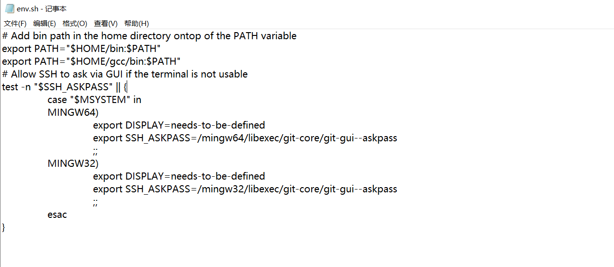

## Git安装gcc编译器和make工具

##### 1、gcc编译器和make工具下载

[http://www.equation.com/servlet/equation.cmd?fa=fortra](https://link.zhihu.com/?target=http%3A//www.equation.com/servlet/equation.cmd%3Ffa%3Dfortran) 

##### 2、gcc和make的安装

双击下载好的exe,一直点击继续，知道安装结束。

##### 3、配置gcc的环境

- 找到Git的安装目录，在Git的安装目录下面找到Git\etc\profile.d\env.sh配置文件

  

- 打开env.sh文件，添加export PATH="$HOME/gcc/bin:$PATH"

  

- 保存之后，双击env.sh就配置完成
- 如果添加之后不能保存env.sh文件，就设置权限