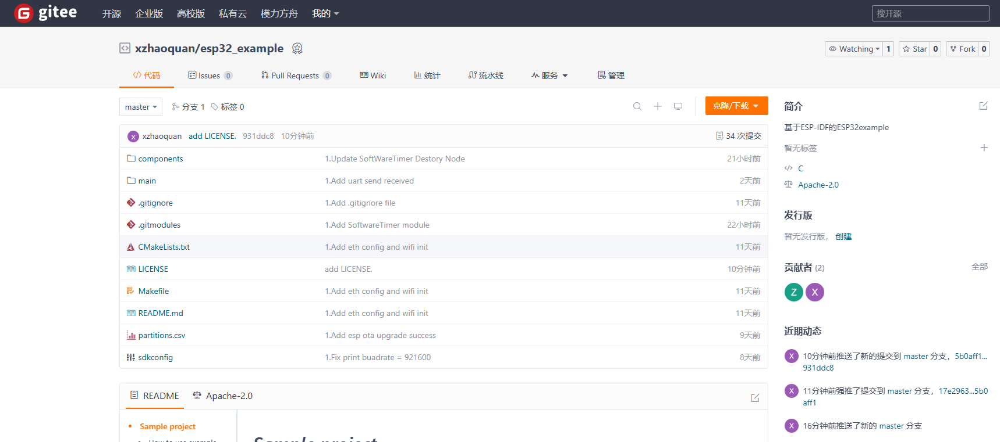

## 如何将git本地仓库添加到云仓库

**在进行下面操作时确保将SSH添加到云仓库**

### 🧱 第一步：在 Gitee 上创建仓库

**在gitee上面新创建git仓库**

1、登录 Gitee：https://gitee.com

2、点击右上角的「+」图标，选择「新建仓库」

3、填写仓库信息（如仓库名、描述、是否公开等）

4、点击「创建」按钮，创建成功后你会看到该仓库的首页和仓库地址（如：`https://gitee.com/your_name/your_repo.git`）



## 💻 第二步：将本地仓库推送到 Gitee

1、添加远程仓库地址（替换成你的 Gitee 仓库地址）

```
git remote add origin https://gitee.com/your_name/your_repo.git
```

2、推送到 Gitee（主分支为 main 或 master，根据实际情况）

```
使用-f 强制推送本地仓库到云仓库
git push -u origin master -f
```

