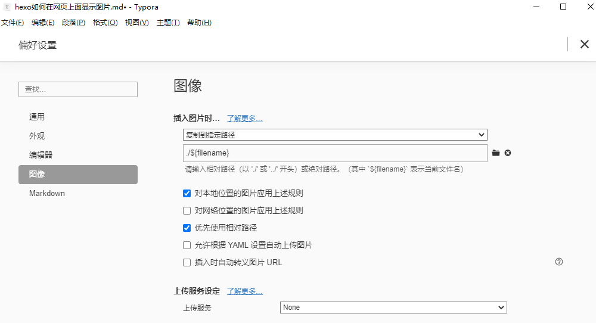

## hexo如何在网页上面显示图片

##### 1、将typora的图像设置设置成复制到指定路径，和优先使用相对路径




##### 2、在根目录安装hexo-asset-image，就能按照markdown的格式进行图片的插入。

```
npm install https://github.com/CodeFalling/hexo-asset-image --save
```

##### 3、配置_config_yml文件

```
//设置 post_asset_folder 为true
post_asset_folder: true
```

