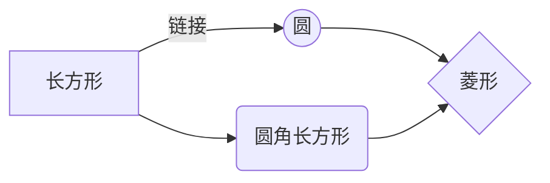

## markdown 使用说明

#### 功能快捷键

撤销：<kbd>Ctrl/Command</kbd> + <kbd>Z</kbd>
重做：<kbd>Ctrl/Command</kbd> + <kbd>Y</kbd>
加粗：<kbd>Ctrl/Command</kbd> + <kbd>B</kbd>
斜体：<kbd>Ctrl/Command</kbd> + <kbd>I</kbd>
标题：<kbd>Ctrl/Command</kbd> + <kbd>Shift</kbd> + <kbd>H</kbd>
无序列表：<kbd>Ctrl/Command</kbd> + <kbd>Shift</kbd> + <kbd>U</kbd>
有序列表：<kbd>Ctrl/Command</kbd> + <kbd>Shift</kbd> + <kbd>O</kbd>
检查列表：<kbd>Ctrl/Command</kbd> + <kbd>Shift</kbd> + <kbd>C</kbd>
插入代码：<kbd>Ctrl/Command</kbd> + <kbd>Shift</kbd> + <kbd>K</kbd>
插入链接：<kbd>Ctrl/Command</kbd> + <kbd>Shift</kbd> + <kbd>L</kbd>
插入图片：<kbd>Ctrl/Command</kbd> + <kbd>Shift</kbd> + <kbd>G</kbd>
查找：<kbd>Ctrl/Command</kbd> + <kbd>F</kbd>
替换：<kbd>Ctrl/Command</kbd> + <kbd>G</kbd>

#### 标题的创建

直接输入1次<kbd>#</kbd>，并按下<kbd>space</kbd>后，将生成1级标题。
输入2次<kbd>#</kbd>，并按下<kbd>space</kbd>后，将生成2级标题。
以此类推，我们支持6级标题。有助于使用`TOC`语法后生成一个完美的目录。

#### 如何改变文本的样式、

```
*强调文本* _强调文本_

**加粗文本** __加粗文本__

==标记文本==

~~删除文本~~

> 引用文本

H~2~O is是液体。

2^10^ 运算结果是 1024.
```

*强调文本* _强调文本_

**加粗文本** __加粗文本__

==标记文本==

~~删除文本~~

> 引用文本

H~2~O is是液体。

2^10^ 运算结果是 1024.

#### 插入链接与图片

```
链接: [link](https://www.csdn.net/).
```

链接: [link](https://www.csdn.net/).

#### 生成列表

```
- 项目
  - 项目
    - 项目

1. 项目1
2. 项目2
3. 项目3

- [ ] 计划任务
- [x] 完成任务
```

- 项目
  - 项目
    - 项目

1. 项目1
2. 项目2
3. 项目3

- [ ] 计划任务
- [x] 完成任务

#### 创建表格

```
项目     | Value
-------- | -----
电脑  | $1600
手机  | $12
导管  | $1
```

| 项目 | Value |
| ---- | ----- |
| 电脑 | $1600 |
| 手机 | $12   |
| 导管 | $1    |

#### 设定内容居中，居左，居右

```
使用`:---------:`居中
使用`:----------`居左
使用`----------:`居右
| 第一列       | 第二列         | 第三列        |
|:-----------:| :-------------:|:-------------|
| 第一列文本居中 | 第二列文本居右  | 第三列文本居左 |
```

使用`:---------:`居中
使用`:----------`居左
使用`----------:`居右

|     第一列     |     第二列     | 第三列         |
| :------------: | :------------: | :------------- |
| 第一列文本居中 | 第二列文本居右 | 第三列文本居左 |

#### 创建一个注脚

```
一个具有注脚的文本。[^2]

[^2]: 注脚的解释
```

一个具有注脚的文本。[^2]

[^2]: 注脚的解释

#### 流程图

```
这将产生一个流程图。:

​```mermaid
graph LR
A[长方形] -- 链接 --> B((圆))
A --> C(圆角长方形)
B --> D{菱形}
C --> D
​```
```

这将产生一个流程图。:



