# MQTT数据帧解析


[TOC]


## MQTT 控制报文格式

#### MQTT控制报文结构组成

- 固定报头（所有控制报文都包含）
- 可变报头
- 消息体

#### 固定报头的组成格式

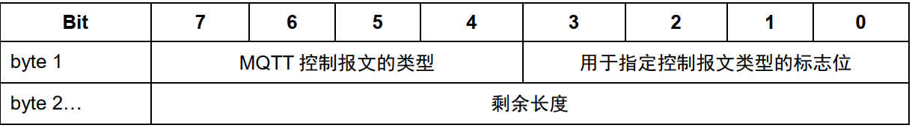

- **控制报文的类型**

  - 控制报文的类型由第一个字节的4-7位组成

  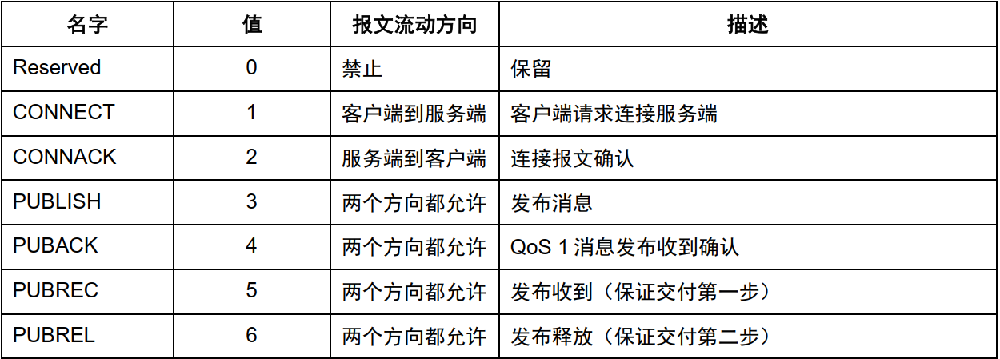

  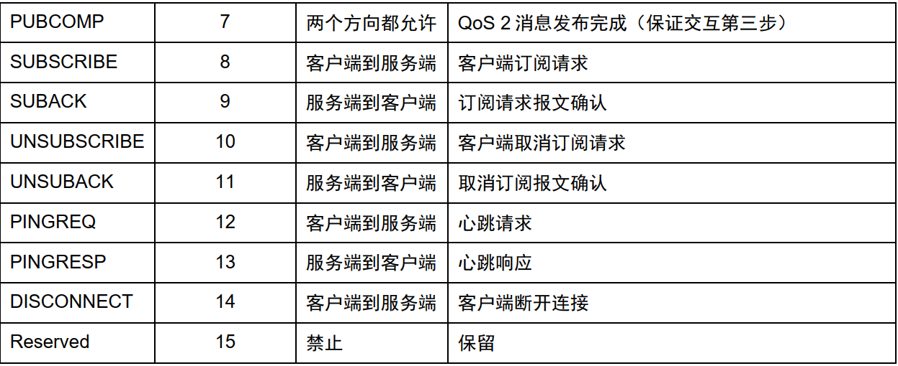

- **控制报文类型标志位**

  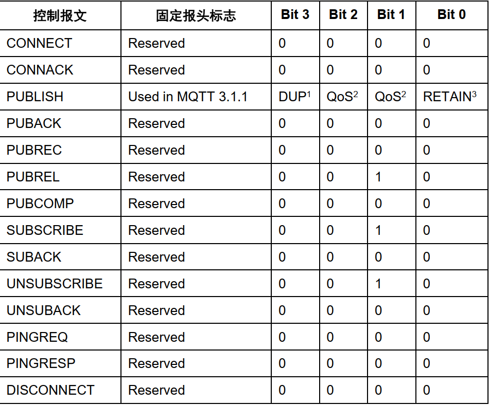

- **剩余长度**：从第二个字节开始，剩余长度（Remaining Length） 表示当前报文剩余部分的字节数， 包括可变报头和负载的数据。 剩余长度不包括用于编码剩余长度字段本身的字节数。  

  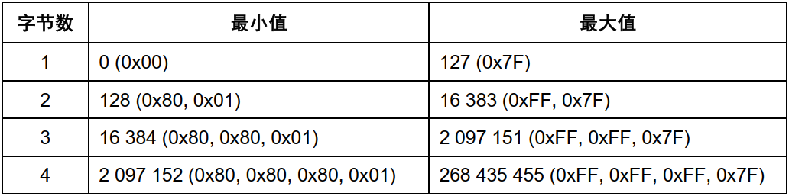

```
分别表示（每个字节的低 7 位用于编码数据， 最高位是标志位） ：
1 个字节时， 从 0(0x00)到 127(0x7f)
2 个字节时， 从 128(0x80,0x01)到 16383(0Xff,0x7f)
3 个字节时， 从 16384(0x80,0x80,0x01)到 2097151(0xFF,0xFF,0x7F)
4 个字节时， 从 2097152(0x80,0x80,0x80,0x01)到 268435455(0xFF,0xFF,0xFF,0x7F)
```


#### 可变报头

**可变报头在固定报头和负载之间，可变报头的内容根据报文类型的不同而不同**

- **报文标识符**

  - **报文标识符类型**

  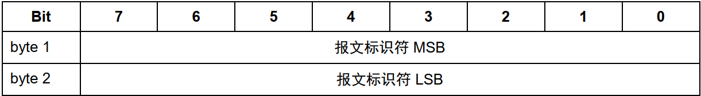

  -  很多控制报文的可变报头部分包含一个两字节的报文标识符字段。 这些报文是 PUBLISH（QoS>0 时），
    PUBACK， PUBREC， PUBREL， PUBCOMP， SUBSCRIBE, SUBACK， UNSUBSCIBE，UNSUBACK。 

  - ```
    1、SUBSCRIBE， UNSUBSCRIBE 和 PUBLISH（QoS 大于 0） 控制报文必须包含一个非零的 16 位报文标识
    符（Packet Identifier）。
    2、客户端每次发送一个新的这些类型的报文时都必须分配一个当前未使用的报文标识符。 
    3、如果一个客户端要重发这个特殊的控制报文，在随后重发那个报文时， 它必须使用相同的标识符。 当客户端处理完这个报文对应的确认后，这个报文标识符就释放可重用。
    4、QoS 1 的 PUBLISH 对应的是 PUBACK， QoS 2 的 PUBLISH 对应的是 PUBCOMP，与 SUBSCRIBE 或
    UNSUBSCRIBE 对应的分别是 SUBACK 或 UNSUBACK [MQTT-2.3.1-3]。 
    5、QoS 设置为 0 的 PUBLISH 报文不能包含报文标识符
    6、PUBACK, PUBREC, PUBREL 报文必须包含与最初发送的 PUBLISH 报文相同的报文标识符
    7、SUBACK 和 UNSUBACK 必须包含在对应的 SUBSCRIBE 和 UNSUBSCRIBE 报文中使用的报文标识符
    ```

  - **包含标识符的控制报文**

  ​	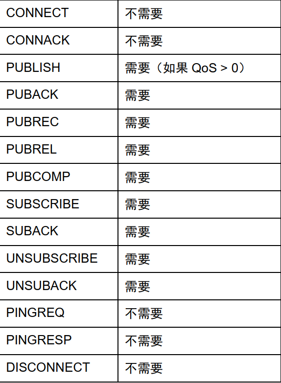

客户端和服务端彼此独立地分配报文标识符。 因此，客户端服务端组合使用相同的报文标识符可以实现并
发的消息交换。  

## MQTT控制报文

### 1、CONNECT-连接服务端

#### 客户端和服务端的网络建立后，第一个报文必须是connect报文，且一个网络连接上只能发送一个网络连接

##### connect连接的固定报头（0x10）

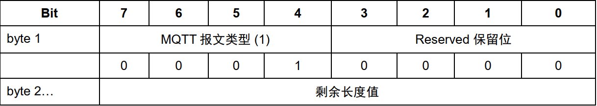

***剩余字段长度长度等于有效负荷长度加上可变报头的长度***

#### 可变报头长度

***CONNECT 报文的可变报头按下列次序包含四个字段：***

- 协议名（Protocol Name） **（协议名是表示协议名 MQTT 的 UTF-8 编码的字符串） **

  - 协议名构成

  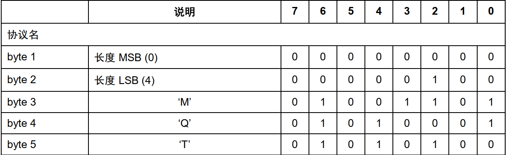

  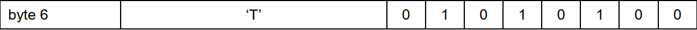

  

- 协议级别（ProtocolLevel） 

  - Protocol Level byte 协议级别字节构成  

  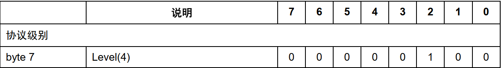

-  连接标志（Connect Flags）

  - 连接标志位**（连接标志字节包含一些用于指定 MQTT 连接行为的参数。 它还指出有效载荷中的字段是否存在。）  **
  - 服务端必须验证 CONNECT 控制报文的保留标志位（第 0 位） 是否为 0， 如果不为 0 必须断开客户端连接 。

  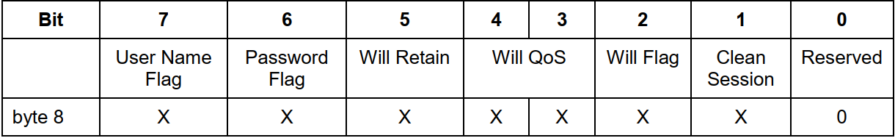

  - 清理会话（CleanSession）

    - CleanSession置0：**表示创建一个持久会话，在客户端断开连接时，会话仍然保持并保存离线消息，直到会话超时注销。**
    - CleanSession置1：**表示创建一个新的临时会话，在客户端断开时，会话自动销毁。**

  - 遗嘱标志（Will Flsg）

    - WillFlag位置1：表示如果连接请求被接受了， 遗嘱（Will Message） 消息必须被存储在服务端并且与这个网络连接关联。  之后网络连接关闭时，服务端必须发布这个遗嘱消息， 除非服务端收到DISCONNECT 报文时删除了这个遗嘱消息  。

      ```
      可以理解为简而言之，就是客户端预先定义好，在自己异常断开的情况下，所留下的最后遗愿（Last Will），也称之为遗嘱（Testament）。这个遗嘱就是一个由客户端预先定义好的主题和对应消息，附加在CONNECT的可变报文头部中，在客户端连接出现异常的情况下，由服务器主动发布此消息。
      ```

    - WillFlag位置0：网络连接断开时， 不能发送遗嘱消息  

  - 遗嘱QoS标志（WillQos）**两位标志位用于指定发布遗嘱消息时使用的服务质量等级。  **

    - WillQoS可以设置：
      - 0x00：遗嘱 QoS  服务质量等级  0
      - 0x01：遗嘱 QoS  服务质量等级  1
      - 0x02：遗嘱 QoS  服务质量等级  2

  - 遗嘱保留标志（WillRetain）：

    - WillRetain置0：遗嘱消息被发布时需要保留  
    - WillRetain置1：遗嘱消息被发布时不需要保留  

  - 用户标志（UserNameFlag）

    - UserNameFlag置0：有效载荷中不能包含用户名字段  
    - UserNameFlag置1：有效载荷中必须包含用户名字段  

  - 密码标志（PasswordFlag）**（如果用户名标志被设置为 0， 密码标志也必须设置为 0  ）**

    - PasswordFlag置0：有效载荷中不能包含密码字段  
    - PasswordFlag置1：有效载荷中必须包含密码字段  

- 保持连接（Keep Alive） 

  **保持字节连接**

  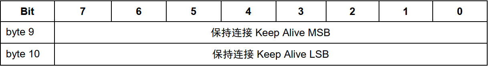

  保持连接（Keep Alive） 是一个以秒为单位的时间间隔，表示为一个 16 位的字，它是指在客户端传输完成一个控制报文的时刻到发送下一个报文的时刻， 两者之间允许空闲的最大时间间隔。  

  - 保持连接的值为零表示关闭保持连接功能  

  - 如果没有任何其它的控制报文可以发送， 客户端必须发送一个**PINGREQ** 报文  
  - 不管保持连接的值是多少，客户端任何时候都可以发送 PINGREQ 报文，并且使用 PINGRESP 报文判断网络和服务端的活动状态。  

  - 客户端发送了 PINGREQ 报文之后， 如果在**合理的时间内仍没有收到 PINGRESP 报文**， 它应该关闭到服务端的网络连接。  

#### 有效负载

***CONNECT 报文的有效载荷（payload） 包含一个或多个以长度为前缀的字段，可变报头中的标志决定是否包含这些字段。 如果包含的话， 必须按这个顺序出现：客户端标识符， 遗嘱主题， 遗嘱消息， 用户名， 密码***

- 客户端标识符（**服务端使用客户端表示符识别客户端**）

  - 连接服务端的每个客户端都有**唯一的客户端标识符**（ClientId） 。客户端和服务端都必须使用 ClientId 识别两者之间的 MQTT 会话相关的状态。
- 客户端标识符 (ClientId) 必须存在而且必须是 CONNECT 报文有效载荷的第一个字段   （**标识符ID必须是UTF8编码，只能包含大小写字母和数字**）
  - 服务端可以允许客户端提供一个零字节的客户端标识符 (ClientId)  ，务端必须将这看作特殊情况并分配唯一的客户端标识符给那个客户端。如果客户端提供了一个零字节的客户端标识符， 它必须同时将清理会话标志设置为 1    

  *客户端标识符的格式：标识符的长度（2byte） +  （标识符）*

- 遗嘱主题

  如果遗嘱标志被设置为 1， 有效载荷的下一个字段是遗嘱主题（Will Topic）  

- 遗嘱消息

  如果遗嘱标志被设置为 1， 有效载荷的下一个字段是遗嘱消息。  	

- 用户名

  如果用户名（User Name） 标志被设置为 1， 有效载荷的下一个字段就是它。  

  *用户名的格式：用户名的长度（2byte） +  （用户名）*

- 密码

  如果密码（Password） 标志被设置为 1， 有效载荷的下一个字段就是它。  密码字段包含一个两字节的长度字段， 长度表示二进制数据的字节数（不包含长度字段本身占用的两个字节） ， 后面跟着 0 到 65535 字节的二进制数据。  
  
  *密码的格式：密码的长度（2byte） +  （密码）*

#### 响应

- 服务端响应
  - 网络连接建立后， 如果服务端在合理的时间内没有收到 CONNECT 报文， 服务端应该关闭这个连接。  
  - 服务端必须按照 3.1 节的要求验证 CONNECT 报文， 如果报文不符合规范， 服务端不发送CONNACK 报文直接关闭网络连接  。
  - 如果任何一项检查没通过，按照 3.2 节的描述，它应该发送一个适当的、 返回码非零的CONNACK 响应， 并且必须关闭这个网络连接。  

### 2、CONNACK-确认连接请求

#### CONNACK固定报头

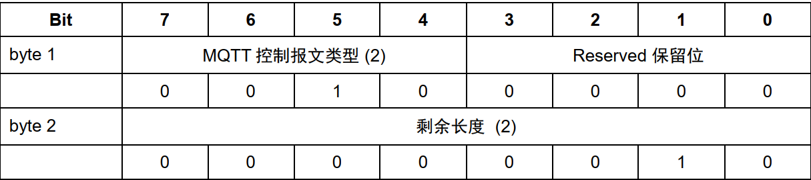

***剩余长度字段  ：***

- 表示可变报头的长度。 对于 CONNACK 报文这个值等于 2。  

#### 可变报头

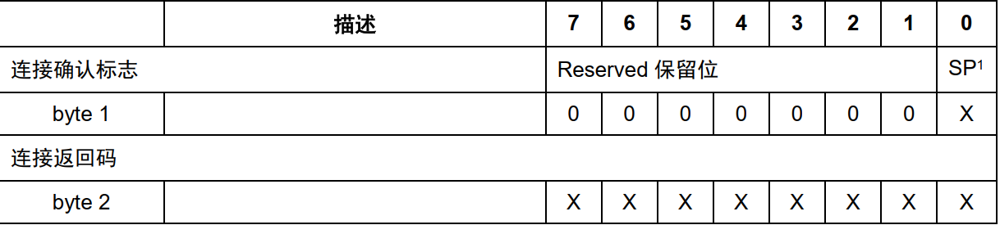

- **确认连接标志**
  
- 第 1 个字节是 连接确认标志， 位 7-1 是保留位且必须设置为 0。  第 0 (SP)位 是当前会话（Session Present） 标志。  
  
- **当前会话**（**连接确认标志的第 0 位。**）

  -   如果服务端收到清理会话（CleanSession） 标志为 1 的连接，除了将 CONNACK 报文中的返回码设置为 0之外，还必须将 CONNACK 报文中的当前会话设置（Session Present） 标志为 0  

  - 如果服务端收到一个 CleanSession 为 0 的连接， 当前会话标志的值取决于服务端是否已经保存了 ClientId对应客户端的会话状态。  

    - 如果服务端已经保存了会话状态， 它必须将 CONNACK 报文中的当前会话标志设置为 1
    - 如果服务端没有已保存的会话状态， 它必须将 CONNACK 报文中的当前会话设置为 0，还需要将 CONNACK 报文中的返回码设置为 0  。

    - 如果服务端发送了一个包含非零返回码的 CONNACK 报文， 它必须将当前会话标志设置为 0  

- **连接返回码（可变报头的第二个字节）**

  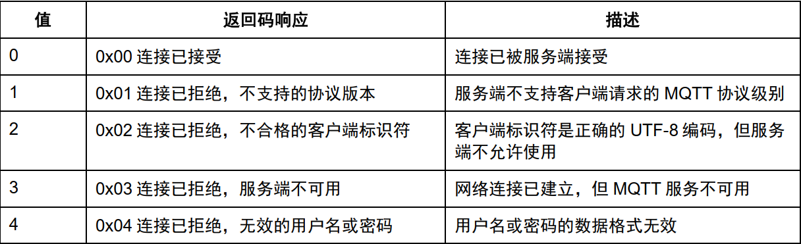

  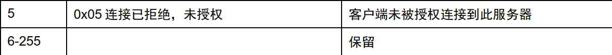

#### 有效负载

无

### 3、PUBLISH-发布消息

#### publish的固定报头：

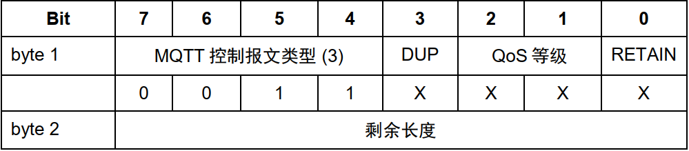

- **重发标志位** **（第一个字节第3位）**
  - DUP 标志被设置为 0， 表示这是客户端或服务端第一次请求发送这个 PUBLISH 报文  
  - DUP 标志被设置为 1，表示这可能是一个早前报文请求的重发。  
  - **客户端或服务端请求重发一个 PUBLISH 报文时， 必须将 DUP 标志设置为 1 ， 对于 QoS0 的消息， DUP 标志必须设置为 0  **

- **服务质量等级** **（第一个字节第1，2位）**

  - QoS值 = 00：最多分发一次
  - QoS值 = 01：至少分发一次
  - QoS值 = 10：只分发一次
  - QoS值 = 11：保留位

- **保留标志位** **（第一个字节第0位）**

  - 如果客户端发给服务端的 PUBLISH 报文的保留（RETAIN） 标志被设置为 1， 服务端必须存储这个应用消息和它的服务质量等级（QoS） ，以便它可以被分发给未来的主题名匹配的订阅者  

  - 服务端发送 PUBLISH 报文给客户端时，如果消息是作为客户端一个新订阅的结果发送， 它必须将报文的保留标志设为 1  
  - 当一个 PUBLISH 报文发送给客户端是因为匹配一个已建立的订阅时，服务端必须将保留标志设为 0  
  - 保留标志为 1 且有效载荷为零字节的 PUBLISH 报文会被服务端当作正常消息处理，它会被发送给订阅主题匹配的客户端。此外，同一个主题下任何现存的保留消息必须被移除，因此这个主题之后的任何订阅者都不会收到一个保留消息  
  - 如果客户端发给服务端的 PUBLISH 报文的保留标志位 0， 服务端不能存储这个消息也不能移除或替换任何现存的保留消息  

- 剩余长度

#### publish可变报头

##### 主题名

- 主题名必须是 PUBLISH 报文可变报头的第一个字段。   
- PUBLISH 报文中的主题名不能包含通配符   

##### 报文标识符

​	只有当 QoS 等级是 1 或 2 时，报文标识符（Packet Identifier） 字段才能出现在 PUBLISH 报文中。   

##### 有效负荷

​	有效载荷包含将被发布的应用消息。  有效载荷的长度这样计算： 用固定报头中的剩余长度字段的值减去可变报头的长度。  

##### 响应

- 服务质量等级Qos0：无响应
- 服务质量等级Qos1：PUBACK 报文
- 服务质量等级Qos2：PUBREC 报文

##### 动作

​	客户端使用 PUBLISH 报文发送应用消息给服务端， 目的是分发到其它订阅匹配的客户端。  

​	服务端使用 PUBLISH 报文发送应用消息给每一个订阅匹配的客户端。  

### 4、PUBACK –发布确认  

PUBACK 报文是对 QoS 1 等级的 PUBLISH 报文的响应。 

#### PUBACK 报文固定报头  

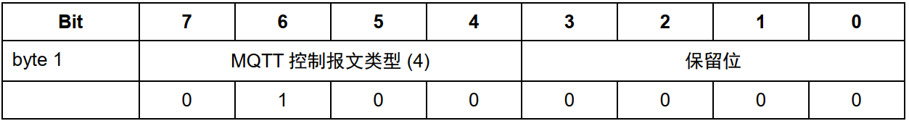 

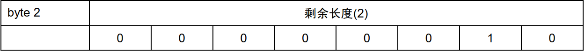

剩余长度字段
表示可变报头的长度。对 PUBACK 报文这个值等于 2.  

#### 可变报头  

包含等待确认的 PUBLISH 报文的报文标识符  

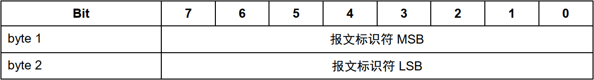

#### 有效负载

无

### 5、PUBREC – 发布收到（QoS 2， 第一步）  

#### PUBREC 报文固定报头  

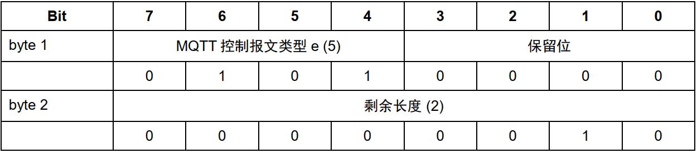

剩余长度字段
表示可变报头的长度。 对 PUBREC 报文它的值等于 2。  

#### PUBREC 可变报头  

可变报头包含等待确认的 PUBLISH 报文的报文标识符。  

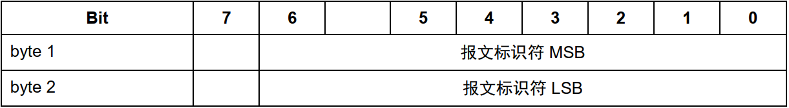

#### 有效负载

无

### 6、PUBREL – 发布释放（QoS 2， 第二步）  

PUBREL 报文是对 PUBREC 报文的响应。 它是 QoS 2 等级协议交换的第三个报文。  

#### 固定报头  

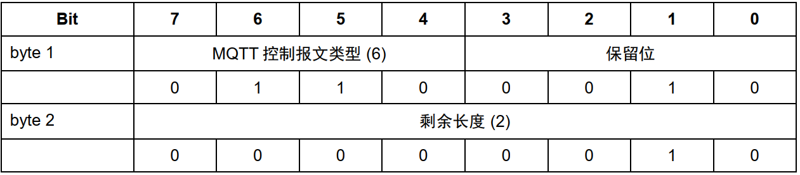

**PUBREL 控制报文固定报头的第 3,2,1,0 位是保留位， 必须被设置为 0,0,1,0。 **

剩余长度字段
表示可变报头的长度。 对 PUBREL 报文这个值等于 2.   

#### PUBREL 报文可变报头  

可变报头包含与等待确认的 PUBREC 报文相同的报文标识符。  

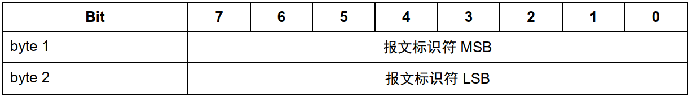

#### 有效负载

无

### 7 、PUBCOMP – 发布完成（QoS 2， 第三步）

PUBCOMP 报文是对 PUBREL 报文的响应。 它是 QoS 2 等级协议交换的第四个也是最后一个报文。    

#### PUBCOMP 报文固定报头  

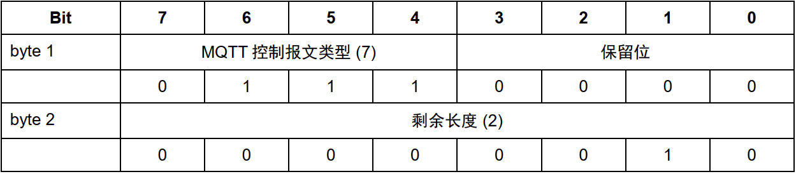

剩余长度字段
表示可变报头的长度。 对 PUBCOMP 报文这个值等于 2。  

#### PUBCOMP 报文可变报头  

可变报头包含与等待确认的 PUBREL 报文相同的报文标识符。  

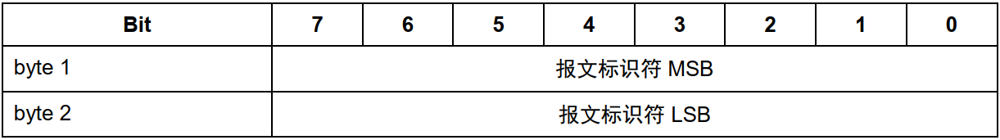

#### 有效负载

无

### 8、SUBSCRIBE - 订阅主题  

客户端向服务端发送 SUBSCRIBE 报文用于创建一个或多个订阅。 每个订阅注册客户端关心的一个或多个主题。 为了将应用消息转发给与那些订阅匹配的主题， 服务端发送 PUBLISH 报文给客户端。 SUBSCRIBE报文也（为每个订阅） 指定了最大的 QoS 等级， 服务端根据这个发送应用消息给客户端。  

#### SUBSCRIBE 报文固定报头  

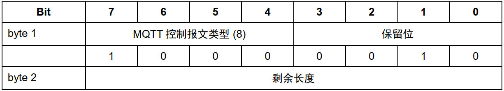

**SUBSCRIBE 控制报固定报头的第 3,2,1,0 位是保留位， 必须分别设置为 0,0,1,0。**  

剩余长度字段
等于可变报头的长度（2 字节） 加上有效载荷的长度。  

#### SUBSCRIBE 可变报头

可变报头包含客户端标识符。  

#### SUBSCRIBE 有效载荷

SUBSCRIBE 报文的有效载荷包含了一个主题过滤器列表， 它们表示客户端想要订阅的主题。  

**报文有效载荷格式**

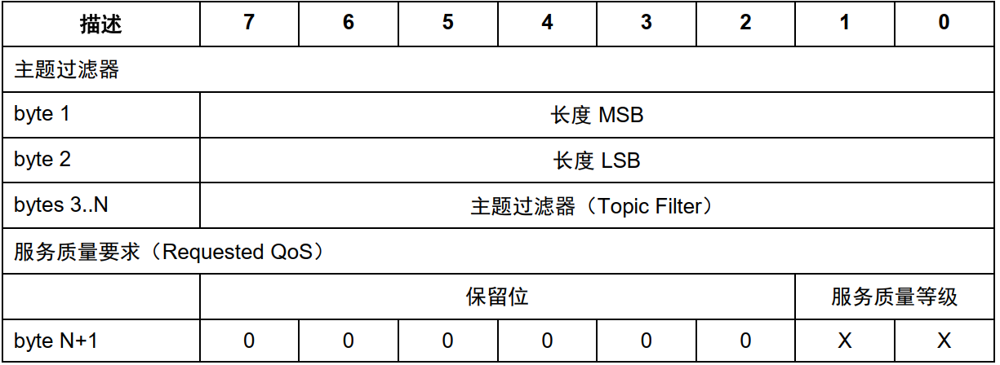


#### 有效载荷字节格式非规范示例  

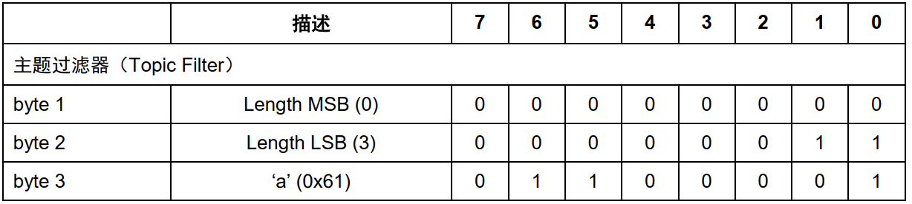

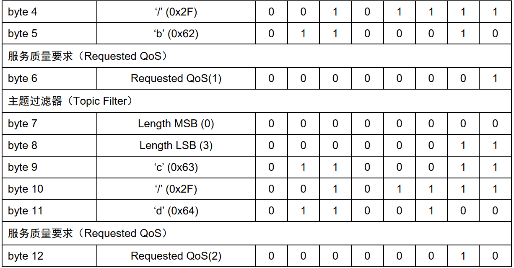

#### 响应

服务端收到客户端发送的一个 SUBSCRIBE 报文时， 必须使用 SUBACK 报文响应  

SUBACK 报文必须和等待确认的 SUBSCRIBE 报文有相同的报文标识符  

### 9、 SUBACK – 订阅确认  

服务端发送 SUBACK 报文给客户端， 用于确认它已收到并且正在处理 SUBSCRIBE 报文。  

SUBACK 报文包含一个返回码清单， 它们指定了 SUBSCRIBE 请求的每个订阅被授予的最大 QoS 等级。  

#### SUBACK 报文固定报头  

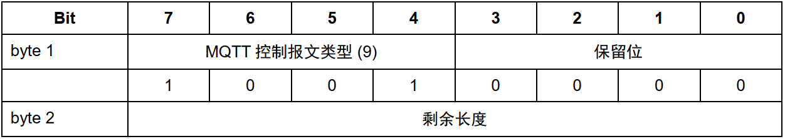

剩余长度字段
等于可变报头的长度加上有效载荷的长度。  

#### SUBACK 报文可变报头  

可变报头包含等待确认的 SUBSCRIBE 报文的报文标识符。  

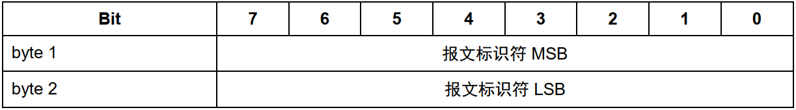

#### 有效载荷

有效载荷包含一个返回码清单。 每个返回码对应等待确认的 SUBSCRIBE 报文中的一个主题过滤器。

返回码的顺序必须和 SUBSCRIBE 报文中主题过滤器的顺序相同  

##### 有效载荷格式

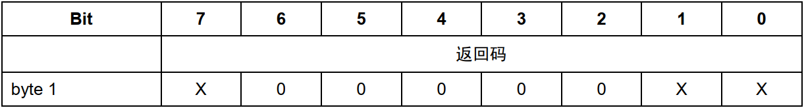

```
允许的返回码值：
0x00 - 最大 QoS 0
0x01 - 成功 – 最大 QoS 1
0x02 - 成功 – 最大 QoS 2
0x80 - Failure 失败
```

### 10 、UNSUBSCRIBE –取消订阅  

客户端发送 UNSUBSCRIBE 报文给服务端， 用于取消订阅主题。  

#### UNSUBSCRIBE 报文固定报头  

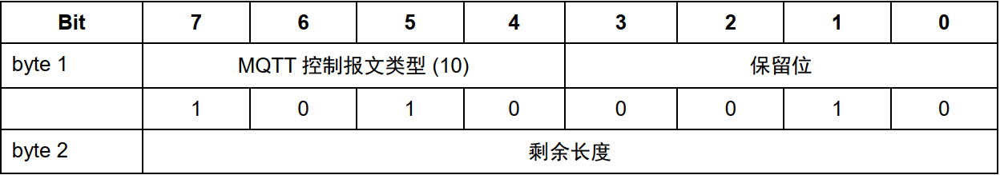

剩余长度字段
等于可变报头的长度加上有效载荷的长度。  

#### UNSUBSCRIBE 报文可变报头  

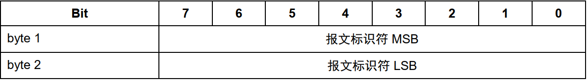

可变报头包含一个报文标识符。  

#### 有效载荷

UNSUBSCRIBE 报文的有效载荷包含客户端想要取消订阅的主题过滤器列表。  

#### 响应

服务端必须发送 UNSUBACK 报文响应客户端的 UNSUBSCRIBE 请求。

UNSUBACK 报文必须包含和UNSUBSCRIBE 报文相同的报文标识符。 即使没有删除任何主题订阅， 服务端也必须发送一个 SUBACK 响应。  

### 11、UNSUBACK – 取消订阅确认  

服务端发送 UNSUBACK 报文给客户端用于确认收到 UNSUBSCRIBE 报文。  

#### UNSUBACK 报文固定报头  

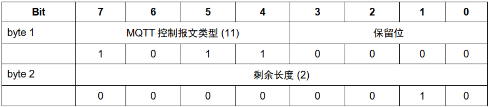

剩余长度字段
表示可变报头的长度， 对 UNSUBACK 报文这个值等于 2。  

#### 可变报头  

可变报头包含等待确认的 UNSUBSCRIBE 报文的报文标识符。  

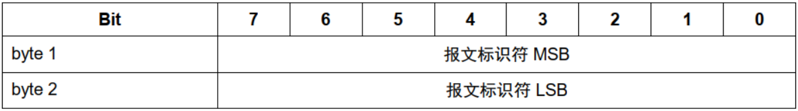

### 有效负载

无

## 12、PINGREQ – 心跳请求  

#### 客户端发送 PINGREQ 报文给服务端的。  

- 在没有任何其它控制报文从客户端发给服务的时，告知服务端客户端还活着。  
- 请求服务端发送 响应确认它还活着。  
- 使用网络以确认网络连接没有断开。  

保持连接（Keep Alive） 处理中用到这个报文  。

#### PINGREQ 报文固定报头  

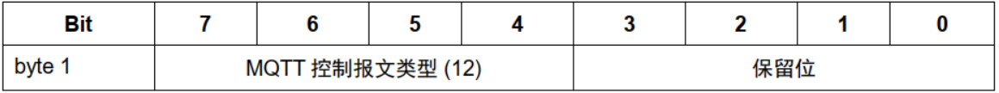

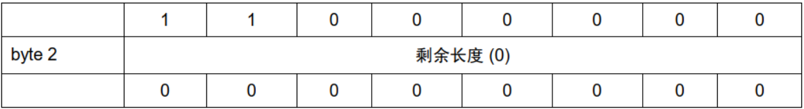

#### 可变报头

无

#### 有效载荷

无

#### 响应

服务端必须发送 PINGRESP 报文响应客户端的 PINGREQ 报文  

### 13、PINGRESP – 心跳响应  

服务端发送 PINGRESP 报文响应客户端的 PINGREQ 报文。 表示服务端还活着。  

#### PINGRESP 报文固定报头  

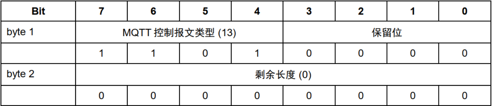

#### 可变报头

无

#### 有效载荷

无

### 14、DISCONNECT –断开连接  

DISCONNECT 报文是客户端发给服务端的最后一个控制报文。表示客户端正常断开连接。  

#### DISCONNECT 报文固定报头  


### 报文例子详解

#### 1、CONECT 报文（client）

```
固定报头(2byte) 0x01 ??
可变报头
	协议名(6byte) 0x00 0x04 'M' 'Q' 'T' 'T'
	协议级别(1byte) ??
	连接标志(1byte) ??
	保持连接(2byte) ?? ??
有效载荷
	客户端标识符(xbyte)
	遗嘱主题(如果开启遗嘱标志才有)(abyte)
	遗嘱消息(如果开启遗嘱标志才有)(bbyte)
	用户名(ybyte)
	密码(zbyte = 2byte + ?)
byte = 2 + 6 + 1 + 1 + 2 + x + y + z
开启遗嘱标志：byte = 2 + 6 + 1 + 1 + 2 + x + y + z + a + b
```

#### 2、CONNACK 报文(server)

```
固定报头(2byte)	0x20 0x20
报文标识符(2byte) ?? ??
byte = 2 + 2
```

#### 3、PUBLISH 报文(client)

```
固定报头(2byte)	?? ??
可变报头
	主题名(xbyte)
	报文标识符(2byte)(只有qos1或qos2才有报文标识符)
有效载荷(ybyte) ?? ?? ...
byte = 2 + x + 2 + y

如果是qos0：byte = 2 + x + y
```

#### 4、PUBACK 报文 (server)

```
固定报头(2byte)	0x40 0x20
报文标识符(2byte) ?? ??
byte = 2 + 2
```

#### 5、PUBREC 报文

```
固定报头(2byte)	0x50 0x20
报文标识符(2byte) ?? ??
byte = 2 + 2
```

#### 6、PUBREL报文

```
固定报头(2byte)	0x60 0x20
报文标识符(2byte) ?? ??
byte = 2 + 2
```

#### 7、PUBCOMP 报文 

```
固定报头(2byte)	0x60 0x20
报文标识符(2byte) ?? ??
byte = 2 + 2
```

#### 8、SUBSCRIBE报文

```
固定报头(2byte)	0x80 ??
可变报头
	报文标识符(2byte) ?? ??
主题过滤器(nbyte = 2byte + xbyte + 1byte) 
	长度(2byte)
	主题过滤器(xbyte)
	服务质量要求(1byte)
byte = 2 + 2 + n
报文标识符主要用于主题订阅和订阅确认的身份识别!!
```

#### 9、SUBACK 报文(server)

```
固定报头(2byte) 0x90 03
可变报头(2byte) ?? ??(返回的这是SUBSCRIBE报文的报文标识符)
有效载荷(1byte) ??
byte = 2 + 2 + 1
```

#### 10、UNSUBSCRIBE  (client)

```
固定报头(2byte)	0xA0 ??
可变报头
	报文标识符(2byte) ?? ??
主题过滤器(nbyte = 2byte + xbyte) 
	长度(2byte)
	主题过滤器(xbyte)
byte = 2 + 2 + n	
```

#### 11、UNSUBACK （server）

```
固定报头(2byte) 0xB0 02
可变报头(2byte) ?? ??(返回的这是SUBSCRIBE报文的报文标识符)
byte = 2 + 2
```

#### 12、PINGREQ报文（client）

```
固定报头(2byte)	0xC0 0x00
byte = 2
```

#### 13、PINGRESP报文（server）

```
固定报头(2byte)	0xD0 0x00
byte = 2
```

#### 14、DISCONNECT报文（client）

```
固定报头(2byte)	0xE0 0x60
byte = 2
```

