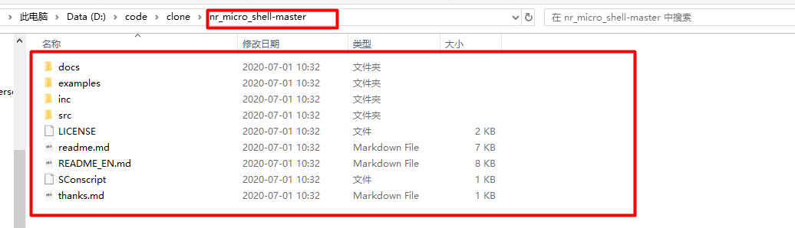
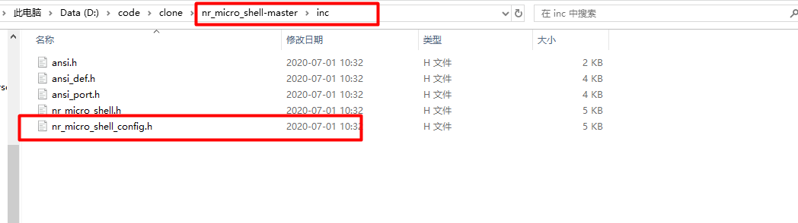
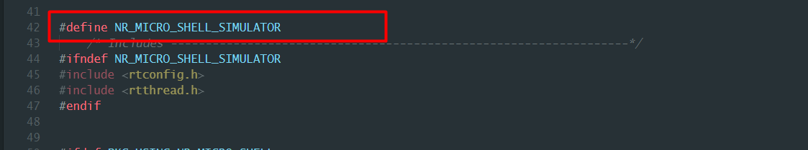
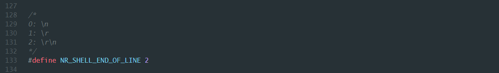
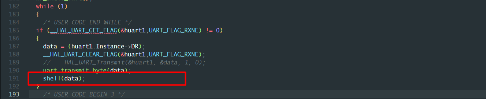
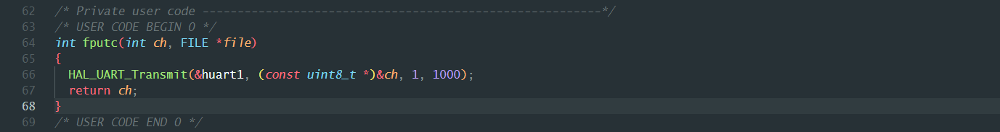
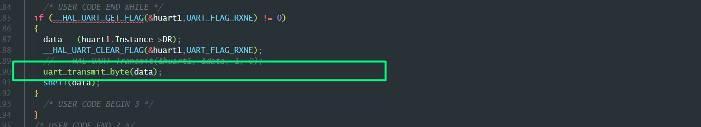
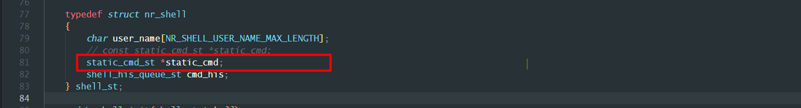
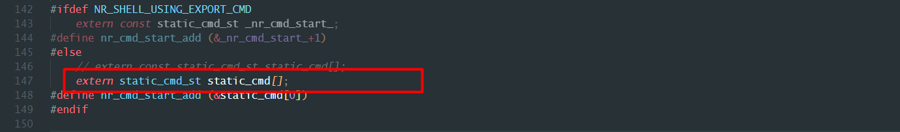
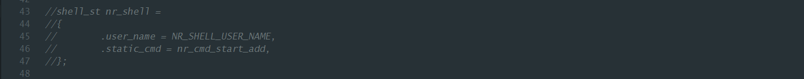

## nr_micro_shell的移植使用

### nr_micro_shell的移植

1、点击下载链接下载nr_micro_shell的源文件。

https://github.com/Nrusher/nr_micro_shell

2、下载完成之后获取nr_micro_shell_master文件夹，将文件夹nr_micro_shell_master文件夹拷贝到工程目录下。



3、找到并打开nr_micro_shell_config.h文件，进行配置。



- 需要定义宏NR_MICRO_SHELL_SIMULATOR(使用裸机配置)

  

- 修改NR_SHELL_END_OF_LINE的值为2(使用\r\n作为结束符)

  

4、定义static_cmd_st数组

```
const static_cmd_st static_cmd[10] = {0};
```

5、初始化shell。

使用shell_init()函数初始shell解析器。

```
shell_init();
```

6、实现UART数据交互接口，调用shell()进行数据解析。



7、需要实现printf的串口重定向操作。



8、如果需要实现回显功能需要在接收数据的时候发送接收的数据到发送端。



### nr_micro_shell的注册使用

为了方便注册和使用，新建文件nr_shell.c和nr_shell.h用来管理shell命令的注册使用。

1、修改nr_shell数据结构，去掉const字段



2、static_cmd_st去掉const字段



3、注释掉nr_micro_shell.c下面的nr_shell



4、添加nr_shell到nr_shell.c文件下面


5、实现nr_shell_command_register，实现help显示和多参数示例。

```
#include "stdint.h"
#include "string.h"
#include "stdlib.h"
#include "stdio.h"
#include "nr_shell.h"
#include "nr_micro_shell.h"

#define SHELL_COMMAND_MAX_NUM	(50)
#define ARGV(a,b) (a + *(a + b))

static static_cmd_st static_cmd[SHELL_COMMAND_MAX_NUM] = {0};
shell_st nr_shell = {.user_name = NR_SHELL_USER_NAME,.static_cmd = nr_cmd_start_add,};


static void nr_shell_help_command(char argc, char *argv)
{
	int16_t i = 0u;

	if (strcmp("help", ARGV(argv, 0)) == 0)
	{
		for (i = 0u; nr_shell.static_cmd[i].fp != NULL; i++)
		{
			printf("%-8s %s\r\n", (char *)nr_shell.static_cmd[i].cmd, nr_shell.static_cmd[i].description != NULL ? nr_shell.static_cmd[i].description : " ");
		}
	}
}


static void nr_shell_mul_param_command(char argc, char *argv)
{
	if (argv == NULL)
	{
		return;
	}

	printf("argc: %d\r\n",argc);
	for (int i = 1; i < argc; i++)
	{
		printf("argv[%d]: %s\r\n",i,ARGV(argv, i));
	}
}

int nr_shell_command_register(char *name, shell_fun_t func, char *description)
{
    uint32_t i, num;

    if (strlen(name) > NR_SHELL_CMD_NAME_MAX_LENGTH)
    {
        return -1;
    }
    num = sizeof(static_cmd) / sizeof(static_cmd[0]);

    for (i = 0; i < num; i++)
    {
        if ((strlen(static_cmd[i].cmd) == 0) && (static_cmd[i].fp == NULL))
        {
            (void)strcpy(static_cmd[i].cmd, name);
            static_cmd[i].fp = func;
            static_cmd[i].description = description;
            break;
        }
        if (i == num - 1)
        {
            return -2;
        }
    }

    return 0;
}

void nr_shell_init(void)
{
	nr_shell_command_register("help", nr_shell_help_command,"帮助信息");
	nr_shell_command_register("param", nr_shell_mul_param_command, "测试参数");
}
```

