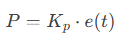
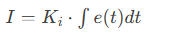
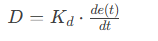
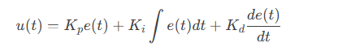
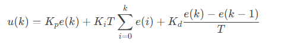
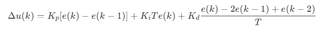
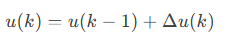

### **由浅入深总结PID控制器：从基础到应用**

------

#### **一、PID控制器的基本概念**

**1. 核心思想**
PID（比例-积分-微分）控制器通过动态调整系统输出，使实际值快速、稳定地跟踪目标值。其核心是**误差驱动**：

- **误差（e(t))**：目标值与实际值的差值。
- **控制目标**：最小化误差的瞬时值、累积值及变化趋势。

**2. 三大组成部分**

- **比例（P）**：根据当前误差调整输出，误差越大，响应越强。
  - **公式**：
  - **作用**：快速响应，但可能导致稳态误差或振荡。
- **积分（I）**：累积历史误差，消除稳态误差。
  - **公式**：
  - **作用**：长期纠偏，但积分过强会导致超调或积分饱和。
- **微分（D）**：预测误差变化趋势，抑制超调。
  - **公式**：
  - **作用**：提升稳定性，但对噪声敏感。

**3. 总输出公式**

------

#### **二、位置式PID：直接控制绝对值**

**1. 核心特点**

- **输出形式**：直接输出控制量的绝对值（如设定电机转速为1000rpm）。
- **积分处理**：累加历史所有误差，长期记忆性强。
- **公式（离散化）**：
  

**2. 优点与缺点**

- **优点**：响应快，适合需要直接设定绝对值的场景（如温度控制）。
- **缺点**：
  - **积分饱和**：执行机构受限时（如阀门全开），积分项持续累积，导致控制滞后。
  - **噪声敏感**：微分项依赖单次差分，易放大高频噪声。

**3. 典型应用**

- 恒温箱加热功率控制
- 阀门开度调节
- 机械臂关节角度控制

**4. 改进技巧**

- **积分抗饱和**：当执行机构达到极限时，冻结积分项累加。
- **滤波处理**：对微分项加入低通滤波器，抑制噪声。

------

#### **三、增量式PID：逐步调整变化量**

**1. 核心特点**

- **输出形式**：输出控制量的增量（如“电机转速增加50rpm”）。
- **积分处理**：仅依赖当前误差，天然抗积分饱和。
- **公式（离散化）**：
  
  - **总控制量**：

- **优点**：
  - **抗饱和**：无需长期累积误差，适合执行机构受限的场景。
  - **噪声抑制**：微分项通过两次差分等效滤波，减少噪声影响。
  - **平滑输出**：增量调整避免突变，适合步进电机等设备。
- **缺点**：
  - 响应速度稍慢于位置式（需逐步累加）。
  - 对参数变化敏感，需精细调参。

**3. 典型应用**

- 步进电机位置控制
- 无人机舵面角度调节
- 电池充电电流平滑调整

**4. 改进技巧**

- **增量限幅**：限制单步增量幅度（如步进电机单步最多5个脉冲）。
- **动态调参**：根据误差大小调整参数（如接近目标时降低比例增益）。

------

#### **四、位置式 vs 增量式：核心对比**

| **特性**       | **位置式PID**               | **增量式PID**                  |
| :------------- | :-------------------------- | :----------------------------- |
| **输出形式**   | 直接设定绝对值（如80%功率） | 输出增量（如+5%功率）          |
| **积分处理**   | 累加所有历史误差，易饱和    | 仅依赖当前误差，抗饱和         |
| **微分项噪声** | 敏感（单次差分）            | 抑制（两次差分等效滤波）       |
| **适用场景**   | 温控、阀门等直接控制场景    | 步进电机、舵机等需平滑调整场景 |
| **代码复杂度** | 需存储积分累加值            | 仅需存储最近2~3次误差          |

------

#### **五、如何选择PID形式？**

1. **选位置式PID**：
   - 执行机构需直接设定绝对值（如加热器功率、阀门开度）。
   - 系统允许输出突变，且需快速响应。
   - **示例**：工业烤箱温度控制。
2. **选增量式PID**：
   - 执行机构需逐步调整（如步进电机、无人机舵机）。
   - 系统对突变敏感，需抑制积分饱和或噪声。
   - **示例**：3D打印机步进电机控制。
3. **混合应用**：
   - 在复杂系统中结合两者优势（如主控制用位置式，辅以增量式抗饱和）。

------

#### **六、进阶技巧与注意事项**

1. **参数整定方法**：
   - **试凑法**：手动调整参数，观察系统响应曲线。
   - **齐格勒-尼科尔斯法**：通过临界振荡周期确定参数。
   - **仿真工具**：使用MATLAB/Simulink优化参数。
2. **抗积分饱和策略**：
   - **Clamping法**：当执行机构达到极限时，停止积分累加。
   - **Back-calculation**：反向计算积分项，避免超调。
3. **噪声处理**：
   - 对传感器信号进行滤波（如移动平均滤波）。
   - 在微分项中引入一阶低通滤波器。
4. **动态适应**：
   - 根据系统状态实时调整PID参数（如误差大时增大 Kp，接近目标时增大 Kd）。

