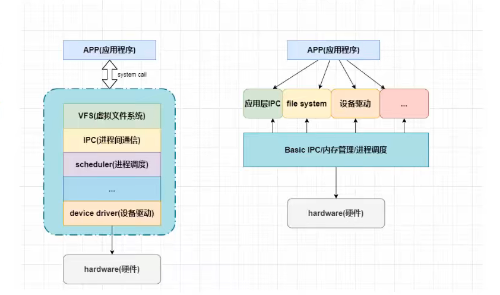
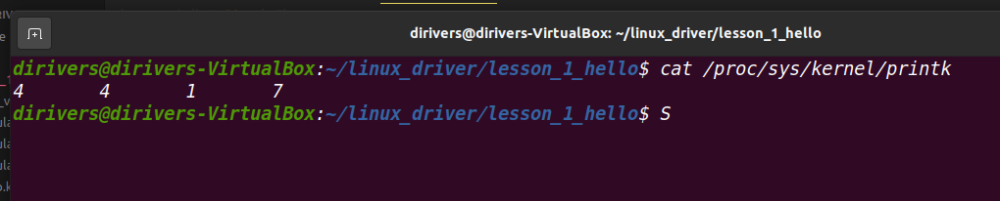

## 内核模块

#### 内核模块概念-现代内核派系

##### 1、现代内核派系-关键功能和服务功能均在内核空间提供（linux）

- 运行效率高
- 扩展性差

##### 2、微内核-内核空间提供关键功能，服务功能在用户空间提供

- 运行效率低
- 扩展性较高

两者区别如下图：




#### 内核模块实验环境搭建

##### 1、搭建开发板环境

- 开发板烧录Debain镜像-当前开发板内核版本：4.19.35-imx6
- 启动开发板，搭建nfs客户端，挂载共享文件夹
- 获取debain镜像内核源码-编译

##### 2、获取内核源码-编译（4.19.35-imx6）

- 获取linux内核源码

  ```
  git clone  https://gitee.com/Embedfire/ebf_linux_kernel_6ull_depth1
  ```

- 安装工具配置环境

  ```
  sudo apt install make gcc-arm-linux-gnueabihf gcc bison flex libssl-dev dpkg-dev lzop
  ```

- 开始编译，构建内核

  ```
  ./make_deb.sh (如果权限不足加上sudo)
  修改build_opts="${build_opts} O=X",可以改变安装的路径，X=你想要存放的路径
  ```

- 获取编译的出来的内核文件的相关文件

  ```
  将路径下存放的当前的内核相关文件 拷贝到你的工程路径下面
  /home/kernel/bulid
  ```

#### 内核模块所需头文件

```
#include <linux/module.h>  //包含内核模块信声明的相关函数
#include <linux/init.h>	 // 包含module_init module_exit 函数声明
#include <linux/kernel.h>	//包含内核提供的各种函数，例如printk内核模块打印函数
```

#### 内核模块函数/命令

##### 1、内核模块加载、卸载

```
内核加载命令：insmod
内核卸载命令：rmmod
```

##### 2、内核函数入口，出口

- 内核函数模块入口-加载模块式函数自动执行，进行初始化操作

- 内核函数模块出口-卸载模块是函数自动执行，进行清理工作

  ```
  内核模块入口函数：		module_init();
  内核模块出口函数：		module_exit();
  ```

##### 3、内核模块信息声明

- MODULE_LICENSE：内核模块版权声明，模块接受软件许可协议

- MODULE_AUTHOR：描述模块作者信息

- MODULE_DESCRIPTION：对模块的简单介绍

- MODULE_ALIAS：给模块设置一个别名

  ```
  内核模块版权声明，模块接受软件许可协议			  		MODULE_LICENSE();
  描述模块作者信息							MODULE_AUTHOR();
  对模块的简单介绍							MODULE_DESCRIPTION();
  给模块设置一个别名							MODULE_ALIAS();
  ```

##### 4、内核模块打印函数

- printk内核模块打印函数-需要指定打印等级

  ```
  //打印等级0-7
  #define KERN_EMERG			"<0>" 通常是系统崩溃前的信息
  #define KERN_ALERT			"<1>" 需要立即处理的消息
  #define KERN_CRIT			"<2>" 严重情况
  #define KERN_ERR			"<3>" 错误情况
  #define KERN_WARNING			"<4>" 有问题的情况
  #define KERN_NOTICE			"<5>" 注意信息
  #define KERN_INFO			"<6>" 普通消息
  #define KERN_DEBUG			"<7>" 调试信息
  
  打印内核所有打印信息：dmesg
  查看当前系统的printk打印等级：cat /proc/sys/kernel/printk
  
  下图的4417对应
  4	当前控制台日志级别
  4 	默认消息日志级别
  1	最小的控制台级别
  7	默认控制台日志级别
  ```

  

##### 5、模块参数

- 模块参数：根据不同应用场合给内核模块传递不同参数，提高内核模块灵活性

- 模块参数函数：module_param

  ```
  module_param(name,type,perm);
  - name 参数名
  - type 参数类型
  - perm 读写权限
  
  数据类型对应type类型：
  int类型：		int<------------> int
  char类型:		char<-----------> byte
  bool类型：		bool<-----------> bool
  字符串类型:		char*<----------> charp
  
  perm读写权限：
  - 不可以设置执行权限 如0777
  - 在sys/modules/模块名/paramters 目录下生成该参数对应的文件名
  ```

##### 6、符号共享

- 内核模块可以共享导出的符号表

- 可以变量共享和函数共享

- 符号共享函数：EXPORT_SYMBOL

  ```
  EXPORT_SYMBOL(sym);
  sym:变量名或者是函数名
  ```

- 查看符号表

  ```
  cat /proc/kallsyms | grep xxx
  xxx:需要查看的模块名
  ```


##### 7、模块加载

- 模块手动加载

  ```
  1、模块加载时必须先加载相关依赖模块
  2、模块卸载时必须先卸载模块，在卸载依赖模块
  ```

- 模块自动加载

  - 将所有内核模块统一放在 “/lib/modules/内核版本”目录下

    ```
    cp *.ko /lib/modules/4.19.35-imx6 
    ```

  - 建立模块依赖关系

    ```
    depmod -a
    ```

  - 查看模块依赖关系

    ```
    cat /lib/modules/4.19.35-imx6/modlue.dep
    ```

  - 加载、卸载模块及其依赖关系

    ```
    加载模块及依赖：		modprobe xxx
    下载模块及依赖：		modprobe -r xxx
    xxx：需要操作的模块
    ```

    

