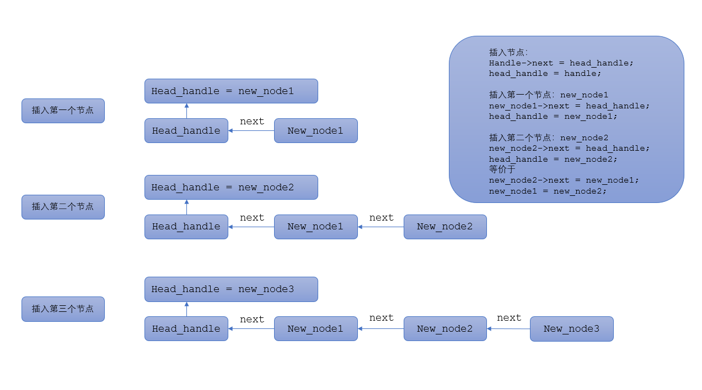
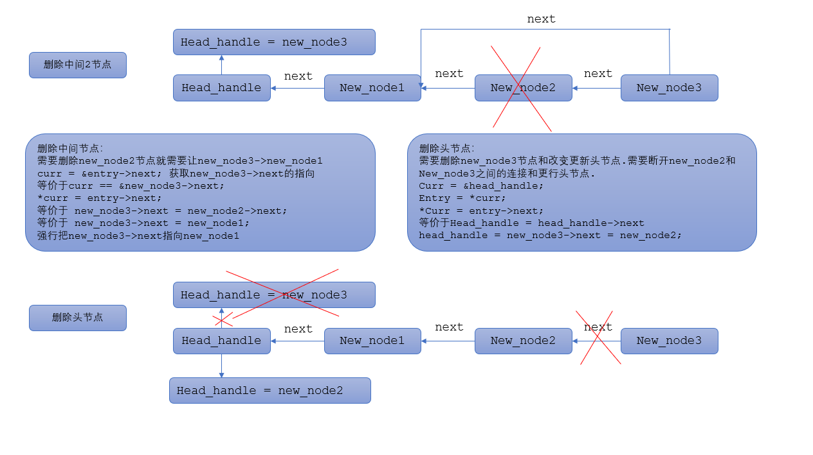

## 单链表头插法

##### 单链表数据结构定义

```
typedef struct timer
{
  int value; //数据
  struct timer *next;//节点
}timer;

//定义头指针head_handle
static struct timer *head_handle;
```

##### 链表初始化

```
void timer_init(struct timer *handle,int value)
{
  memset(handle,0,sizeof(struct timer));
  handle->buff = NULL;
  handle->value = value;
}
```

##### 创建链表（头插法）



```
int start_timer(struct timer *handle)
{
  struct timer *target = head_handle;
  while(target)
  {
    if(target == handle) //判断新创建的节点是否和以前创建的是否相同
    {
      return -1;
    }
    target = target->next;
  }
  handle->next = head_handle;
  head_handle = handle;
  return 0;
}

//new_node1节点创建之前头节点 head_handle == NULL
//new_node1节点创建之后头节点 head_handle == new_node1
//当前链表链接顺序：new_node1->head_handle
//new_node2节点创建之后头节点 head_handle == new_node2
//当前链表链接顺序：new_node2->new_node1->head_handle
```


##### 删除链表



```
void timer_stop(struct timer *handle)
{
  struct timer **curr;
  for(curr = &head_handle;*curr;)
  {
    struct timer *entry = *curr;
    if(entry == handle)
    {
      *curr = entry->next;
      return ;
    }
    else
    {
      curr = &entry->next;
    }
  }
}
```

##### 链表遍历

```
void timer_traverse(void)
{
  struct timer *target;
  //根据链表头节点遍历整个链表
  for(target = head_handle;target;target = target->next)
  {
    printf("timer value : %d\r\n",target->value);
  }
  printf("\r\n");
}
```

