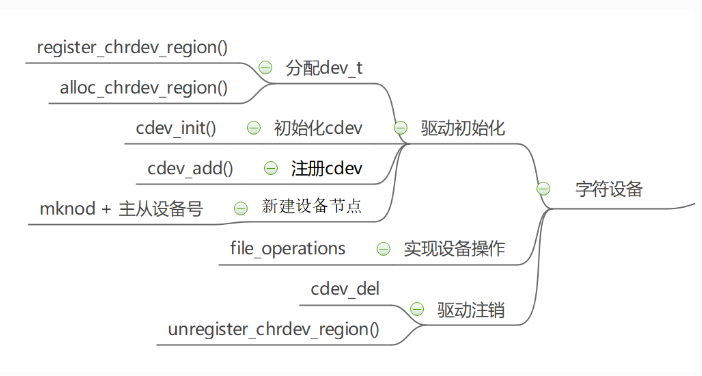
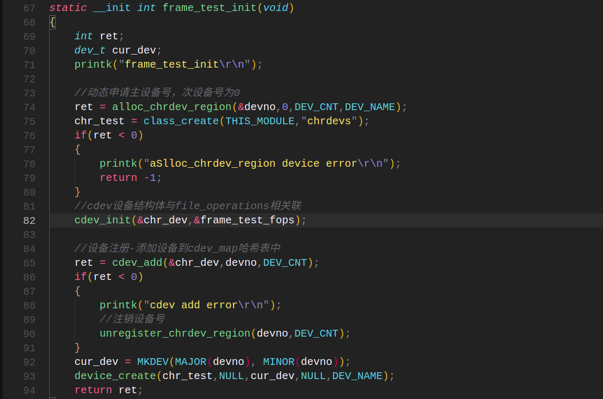
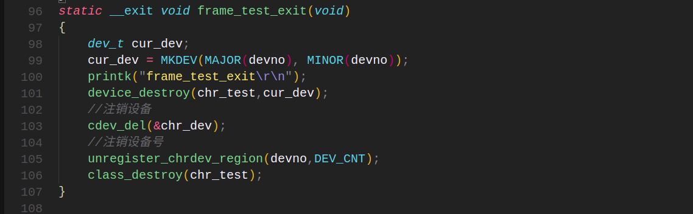

## 字符设备驱动

#### 设备驱动框架



##### 1、设备号的申请和注销

- 设备号的定义

  ```
  static struct cdev chrdev;
  ```

- 使用register_chrdev_region函数静态申请设备号

  ```
  register_chrdev_region函数用于静态地为一个字符设备申请一个或多个设备编号。一般用于指定手动分配主设备号。
  函数原型：int register_chrdev_region(dev_t from, unsigned count, const char *name)
  参数：
  from：需要注册的设备号，不能与被注册的设备号相同
  count：需要申请的设备号个数
  name：申请的设备号名称 在 "cat /proc/devices"下可查看到设备名称和设备号
  返回值：0成功 其他失败
  ```

- 调用alloc_chrdev_region函数动态的申请设备号

  ```
  调用alloc_chrdev_region函数，内核会自动分配给我们一个尚未使用的主设备号。
  函数原型：int alloc_chrdev_region(dev_t *dev, unsigned baseminor, unsigned count, const char *name)
  参数：
  dev：指向dev_t类型数据的指针变量，用于存放分配到的设备编号的起始值；
  baseminor：次设备号的起始值，通常为0
  count：指定需要分配的设备编号个数
  name：设备名称
  返回值：返回0成功
  ```

- 注销申请的字符设备号

  ```
  使用xxx_chrdev_region()函数申请的设备号可以使用unregister_chrdev_region()注销
  函数原型：void unregister_chrdev_region(dev_t from, unsigned count)
  参数：
  from：指定需要注销的字符设备的设备编号起始值
  count：指定需要注销的字符设备编号的个数，该值应与申请函数的count值相等
  ```

- register_chrdev函数申请设备号

  ```
  register_chrdev函数用于分配设备号
  函数原型：static inline int register_chrdev(unsigned int major, const char *name,const struct file_operations *fops)
  {
     return __register_chrdev(major, 0, 256, name, fops);
  }
  
  参数：
  major：用于指定要申请的字符设备的主设备号，major = 0 时，内核会自动分配一个未使用的主设备号。
  name：设备名称
  fops：用于操作该设备的函数接口指针
  返回值：主设备号
  ```

- unregister_chrdev注销申请的字符设备号

  ```
  使用register函数申请的设备号，则应该使用unregister_chrdev函数进行注销。
  函数原型：static inline void unregister_chrdev(unsigned int major, const char *name)
  {
  __unregister_chrdev(major, 0, 256, name);
  }
  
  参数：
  major：指定需要释放的字符设备的主设备号
  name：执行需要释放的字符设备的名称
  ```

- 设备号宏

  ```
  #define MAJOR(dev)	((unsigned int) ((dev) >> MINORBITS))
  #define MINOR(dev)	((unsigned int) ((dev) & MINORMASK))
  #define MKDEV(ma,mi)	(((ma) << MINORBITS) | (mi))
  
  MINOR(dev)：用来获取该设备文件的次设备号
  MINOR(dev)：用来获取该设备文件的主设备号
  MKDEV(ma,mi)：将主设备号和次设备号一起转成dev_t类型的设备号
  ```

  

##### 2、实现file_operations结构体和初始化cdev

- 实现file_operations结构体里面的函数

  ```
  static struct file_operations led_chrdev_fops = {
  	.owner = THIS_MODULE,
  	.open = led_chrdev_open,
  	.release = led_chrdev_release,
  	.write = led_chrdev_write,
  };
  实现我们需要用的函数：
  static int led_chrdev_open(struct inode *inode, struct file *filp)；
  static int led_chrdev_release(struct inode *inode, struct file *filp)；
  static ssize_t led_chrdev_write(struct file *filp, const char __user * buf,
  				size_t count, loff_t * ppos)；
  ```

- 初始化cdev

  ```
  使用cdev_init函数将cdev和file_operations 相关联起来
  函数原型：void cdev_init(struct cdev *cdev, const struct file_operations *fops)
  参数：
  cdev：struct cdev类型的指针变量，指向需要关联的字符设备结构体；
  fops：file_operations类型的结构体指针变量，一般将实现操作该设备的结构体file_operations结构体作为实参。
  ```

##### 3、设备注册和注销

- 设备注册

  ```
  cdev_add函数用于向内核的cdev_map散列表添加一个新的字符设备
  函数原型：int cdev_add(struct cdev *p, dev_t dev, unsigned count)
  参数：
  p：struct cdev类型的指针，用于指定需要添加的字符设备
  dev：dev_t类型变量，用于指定设备的起始编号
  count：指定注册多少个设备
  返回值：返回为0 添加成功
  ```

- 设备注销

  ```
  cdev_del函数用于向内核的cdev_map散列表删除注册的字符设备
  函数原型：void cdev_del(struct cdev *p)
  参数：
  p：struct cdev类型的指针，用于指定需要删除的字符设备；
  ```

##### 4、设备的逻辑类的创建和删除

- 动态创建设备的逻辑类

  ```
  class_create()用于动态创建设备的逻辑类，并完成部分字段的初始化，然后将其添加进Linux内核系统中。
  此函数的执行效果就是在/sys/class/目录下创建一个新的文件夹。
  宏原型：#define class_create(owner, name)		\
  ({						\
  	static struct lock_class_key __key;	\
  	__class_create(owner, name, &__key);	\
  })
  
  参数：
  owner：一个struct module结构体类型的指针，一般赋值为THIS_MODULE
  name：代表即将创建的struct class变量的名字，用于给struct class的name字段赋值
  
  class_create(THISMODULE,"chrdev"); //在 /sys/class/目录下面创建一个chrdev文件
  ```

- 删除设备的逻辑类

  ```
  函数class_destroy()用于删除设备的逻辑类即从Linux内核系统中删除设备的逻辑类。
  此函数执行的效果是删除函数__class_create()或宏class_create()在/sys/class/目录下创建的逻辑类对应的文件夹。
  函数原型：void class_destroy(struct class *cls);
  参数：
  cls：创建成功的class设备的逻辑类
  ```

  

##### 5、设备节点的创建和销毁

- 代码设备节点的创建

  ```
  device_create函数创建一个设备并将其注册到文件系统
  函数原型：struct device *device_create(struct class *class, struct device *parent,
              dev_t devt, void *drvdata, const char *fmt, ...)
  参数：
  class：指向这个设备应该注册到的struct类的指针
  parent：指向此新设备的父结构设备（如果有）的指针
  devt：要添加的char设备的开发
  drvdata：要添加到设备进行回调的数据
  fmt：输入设备名称
  
  返回值：成功返回 struct device 结构体指针, 错误时返回ERR_PTR().
  
  example:
  struct class *led_chrdev_class;
  led_chrdev_class = class_create(THIS_MODULE, "led_chrdev"); //在 /dev/目录下面创建led_chrdev的设备节点文件
  device_create(led_chrdev_class, NULL, cur_dev, NULL,DEV_NAME "%d", i);
  ```

- 代码设备节点的销毁

  ```
  使用device_destroy删除使用device_create函数创建的设备
  函数原型：void device_destroy(struct class *class, dev_t devt)
  参数：
  class：指向注册此设备的struct类的指针；
  devt：以前注册的设备的开发
  
  example:
  static dev_t devno;//已分配的主设备号
  dev_t cur_dev;
  cur_dev = MKDEV(MAJOR(devno), MINOR(devno) + i); //将主设备和次设备转化成dev_t类型的设备号
  device_destroy(led_chrdev_class, cur_dev);//销毁设备节点
  class_destroy(led_chrdev_class);
  ```

  注意：class_create 和 class_destroy是成对出现的不可只单独使用其中一个。

- 使用mknod命令创建节点

  ```
  可以使用mknod命令创建设备节点。
  用法：mknod 设备名 设备类型 主设备号 次设备号
  设备类型：
  - b 创建（有缓冲的）区块特殊文件
  - c,u 创建(没有缓冲的)字符特殊文件
  - p 创建先进先出(FIFO)特殊文件
  
  example:
  //创建一个字符设备/dev/led 主设备号为200 次设备号为0
  mknod /dev/led c 200 0
  ```

#####  6、字符设备驱动流程

- 设备驱动流程

  

- 设备卸载流程

  

##### 常用命令

```
lsmod 显示已载入系统的模块
modinfo+模块名字 查看模块详细信息
ls /dev/ 查看设备节点
cat /proc/devices 查看设备和设备号
```


