## 红黑树（rbtree）


[TOC]

### 红黑树特性

- 1、节点是红节点或者是黑节点
- 2、根节点为黑色
- 3、叶节点为黑色（叶节点是指末梢的空姐点Nil或NULL）（保证一半以上是黑节点）（是一个满二叉树）
- 4、红节点的子节点必须是黑节点
- 5、新插入的节点是红节点
- 6、每个节点到叶子节点的所有路径，都包含相同数目的黑色节点（相同黑色高度）

红黑树规则说明：

- 规则4和5保证了红黑树的大致平衡，根节点到叶子的所有路径中，最长路径不会超过最短路径的两倍

  使得红黑树在最坏的情况下，也能有O（log2N）的查找效率；

#### 红黑树插入规律

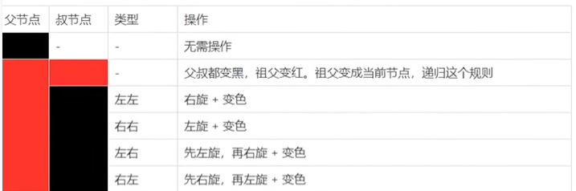

### 红黑树的基本操作左旋右旋

#### 对X节点进行左旋

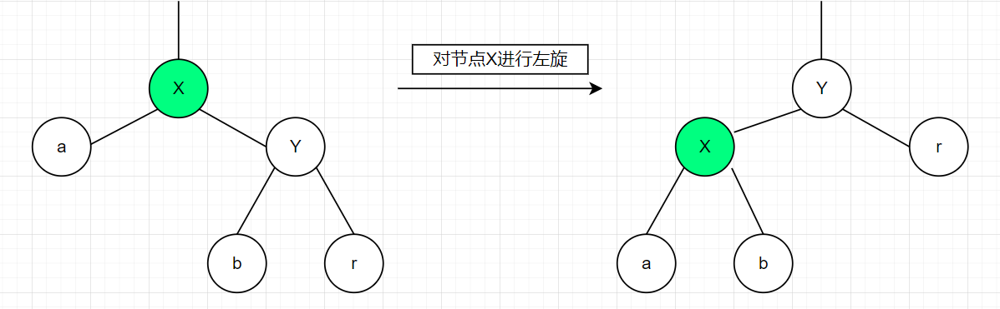

#### 对X节点进行右旋

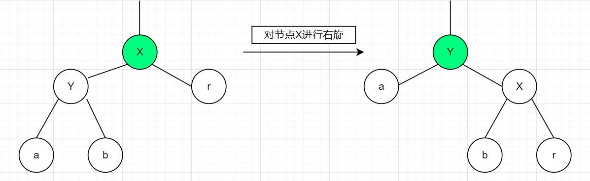

### 红黑树节点添加调整

##### 红黑树节点添加（添加的节点都是红色节点）

将红黑树当作普通二叉树添加节点，只有在进行调整和着色。

当节点插入成功之后，我们需要根据插入的节点进行调整，使其变成一颗红黑树。

##### 插入节点的调整

节点插入之后可能出现3种情况：

- 情况1：插入节点的父亲节点和叔叔节点是红色

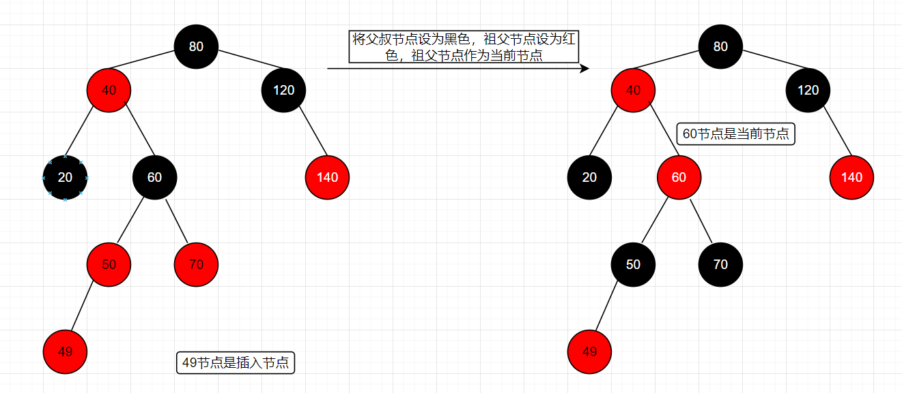

情况1处理：

```
1、将插入节点的父节点设为黑色
2、将插入节点的叔叔节点设为黑色
3、将插入节点的祖父节点设为红色
4、将祖父节点设为当前节点，之后继续对红色节点操作
```

情况1处理完成之后会变成，情况2

- 情况2：插入节点的叔叔节点是黑色，且当前节点是父节点的右孩子

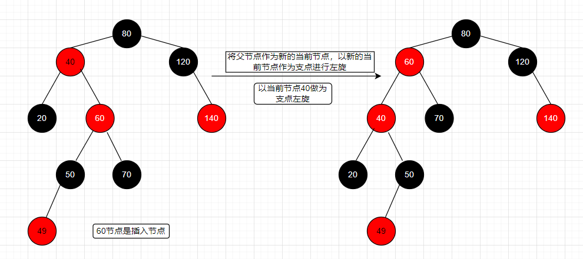

情况2处理：

```
1、将父节点作为新的当前节点
2、以新的当前节点作为支点进行左旋
```


- 情况3：插入节点的叔叔节点是黑色，且当前节点是父节点的左孩子

  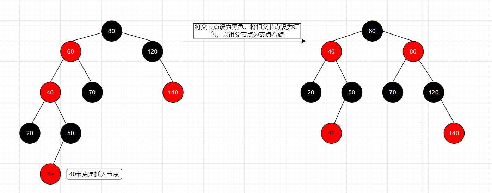

情况3处理：

```
1、将父亲节点设为黑色
2、将祖父节点设为红色
3、以祖父节点为支点进行右旋
```

### 红黑树节点删除

#### 红黑树节点删除可能出现的情况

##### 被删除节点无子节点

- case 1:被删除节点为红色

  - 不需要任何处理，红黑树是平衡的。

- case 2:被删除节点为黑色

  因为删除黑色结点会破坏红黑树的性质5，所以为了不破坏性质5，将node删除后用一个拥有额外黑色的null替代它（可以想象是将node删除后，在这个位置放了一个黑色的权值），剩下的就是调平的过程，最终这个游离的黑色权值被扔掉，整个删除操作完成。

  - 1、node节点的兄弟节点是红色

    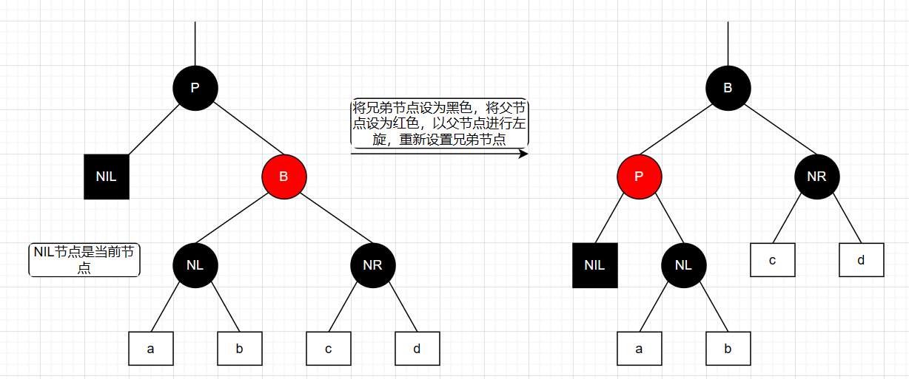

    处理：

    ```
    （左旋父，父祖换色）
    1、将node的兄弟节点设为“黑色”。
    2、将node的父节点设为“红色”。
    3、对node的父节点进行左旋。
    4、左旋后，重新设置node的兄弟节点。
    ```

    如果NL节点下面的节点是NIL节点的话，就变成case4情况。

    如果NIL节点下面的左节点是红节点，右节点是黑色。变成case3情况.

    如果NIL节点下面的右节点是红节点，左节点是黑色。变成case2情况.

  - 2、node的兄弟节点是黑色，兄弟节点的右孩子是红色（兄黑，右红侄）

    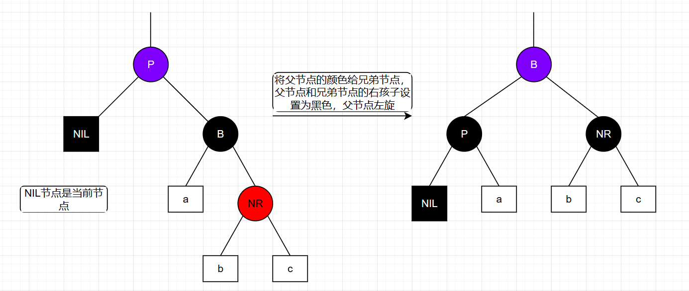

    处理：（处理后，红黑树平衡）

    ```
    （左旋父，祖染父色，父叔黑）
    1、将node父亲节点的颜色赋值给node的兄弟节点
    2、将node父亲节点设为黑色
    3、将node兄弟节点的右孩子设为黑色
    4、以node父亲节点为支点进行左旋
    5、设置node节点为根节点
    ```

  - 3、node的兄弟节点是黑色，兄弟节点的左孩子是红色（兄黑，左红侄）

    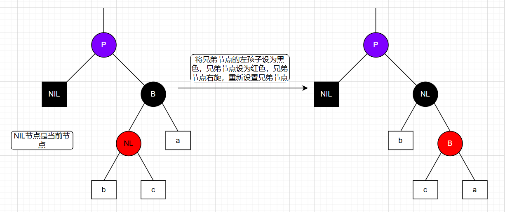

    处理：（处理后变成兄黑，右红侄）

    ```
    （右旋兄，交换兄弟节点与其右子节点颜色）
    1、将node兄弟节点的左孩子设为“黑色”。
    2、将node兄弟节点设为“红色”。
    3、对node的兄弟节点进行右旋。
    4、 右旋后，重新设置node的兄弟节点。
    ```

  - 4、node节点的兄弟节点是黑色，双黑节点（兄弟节点的子节点是NIL节点）

    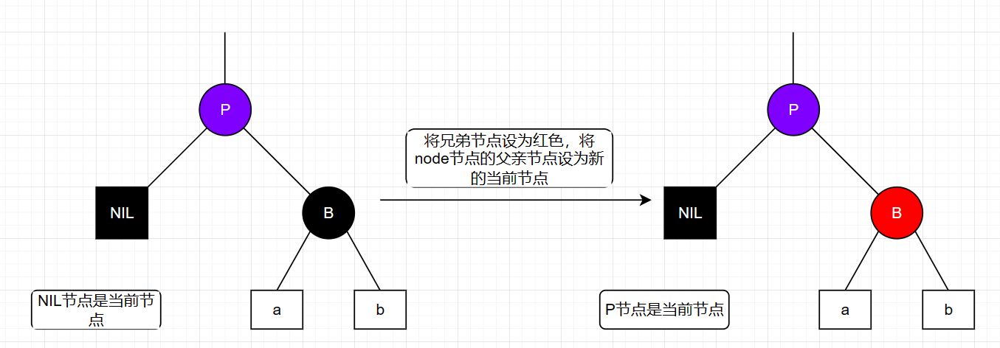

    处理：

    ```
    （兄弟红，用递归，遇到根节点或者是红节点，染黑回）
    （将兄弟染红，视角递归到P节点（或者说是当前节点是NIL节点的父节点），如果P节点是红色或者是根节点，就直接将P节点染黑返回）
    1、将node节点的兄弟节点设为红色
    2、将node的父节点设为新的node节点
    ```

    如果P节点是红色，直接将P节点染黑返回

    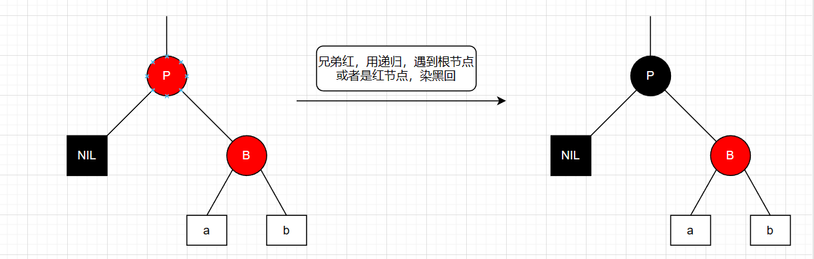

    如果P节点是黑色，会变成case1情况。

##### 被删除节点只有一个子节点

- case 3:被删除节点是黑色（被删除节点是红色不可能，违反规则）

  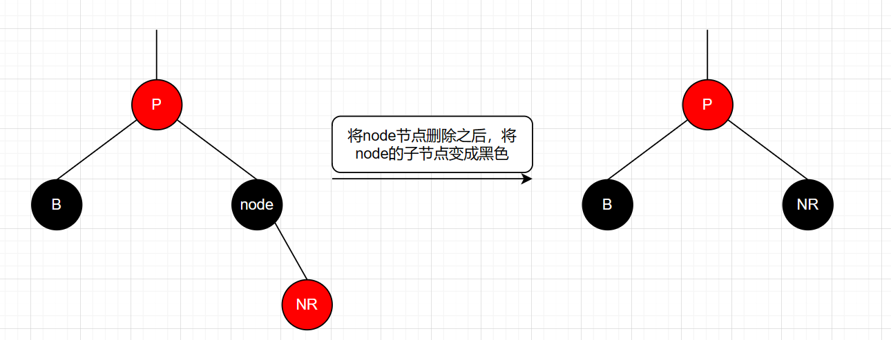

  - 将Node节点删除之后，把他的子节点变成黑色完成红黑树平衡

##### 被删节点有两个子节点（被删节点是黑色或者是红色）

当被删节点有两个节点的时候，需要先找到这个被删节点的后继节点（或者是前驱节点），不用改变颜色，将后继节点替换删除节点。

如果删除节点的后继节点是（node->right>nl）,使用nl替换删除node之后，出现以下情况：

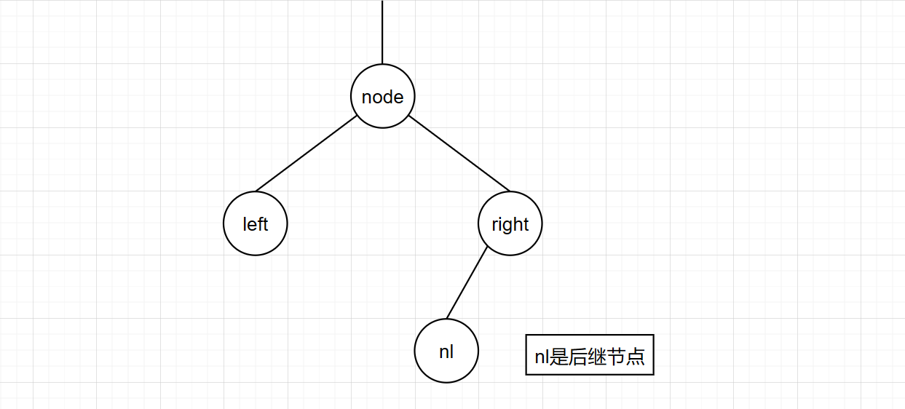

- 如果nl是黑色，会转变成case 2
- 如果nl是红色,   会转变成case 1

如果删除节点的后继节点是（node->right）,使用nl替换删除node之后，出现一下情况：

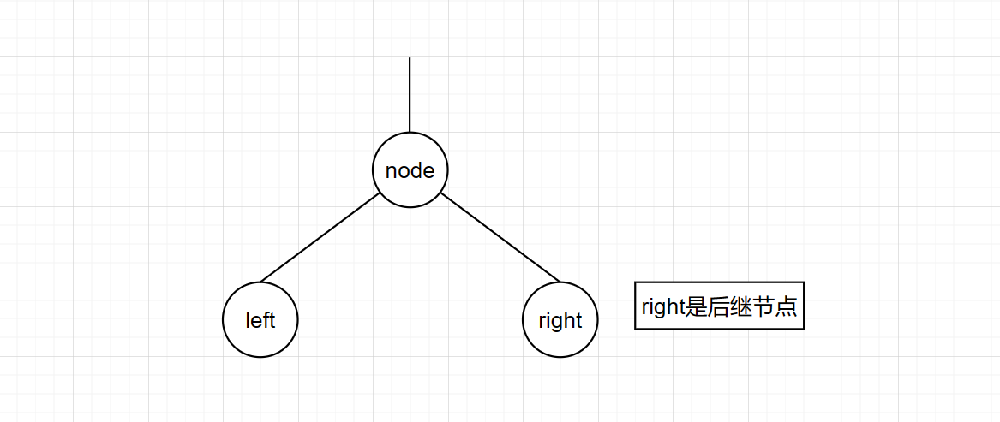

- 如果right是黑色，会变成 case 3 
- 如果right是红色，会变成case 1 

